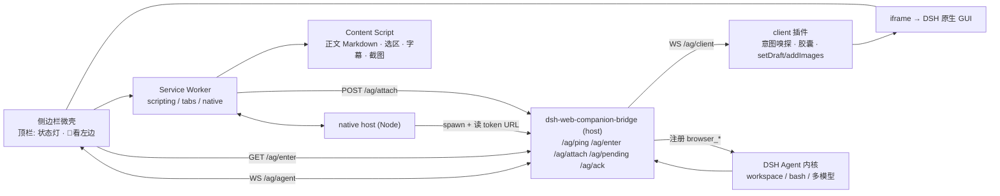

# DSH Web Companion — 设计摘要（DESIGN）

**版本** v3.1 · **日期** 2026-09-11
**⚠️ 唯一权威**：[详细设计文档.md](./详细设计文档.md)（v3.1，工程实现基准）。本文只是索引式摘要；**两者冲突时以详细设计文档为准**，并视为阻断项立即修复（§13.2 纪律 3）。
**其他文档**：[PRD_需求定义说明书.md](./PRD_需求定义说明书.md) · [FINDINGS.md](./FINDINGS.md)（实测实证） · [docs/REVIEW-v3.0.md](./docs/REVIEW-v3.0.md)（内部评审） · [docs/reviews/](./docs/reviews/)（PiMoa 对抗审核） · [docs/DOC-GRAPH.md](./docs/DOC-GRAPH.md)（文档↔代码图谱）

---

## 0. 一句话结论

侧边栏 = **微壳容器 + DSH 原生 GUI 内嵌**（iframe）；技术栈 = **TypeScript 扩展 + DSH 进程内 Node 插件**；内核 = **DSH 单内核**（视觉层 100% 复用，**但桥接逻辑仍需自写 client 插件**）；触发 = **「看左边」意图 + 顶栏按钮 + 快捷键**（**嗅探点在 DSH client 插件内**，因为用户输入的输入框在跨域 iframe 里）；拉起 = **native messaging（Node 脚本，非 Go）**，见 §0.2 待拍板 H4；平台 = Chromium 系，Safari 不做。

---

## 1. 待拍板决策 H4（唯一未决）

**DSH 未运行时是否自动拉起？** 本版按 **①恢复自动拉起**（native messaging，约 1 天）设计——依据是你此前明确选择过该能力，且它不需要 Go。若选 ②（不做，依赖用户手动先起 DSH），必须同时删除 G4 并在降级矩阵改文案。详见 [详细设计文档 §0.2](./详细设计文档.md)。

---

## 2. 量化验收标准（摘要）

| 编号 | 目标 | 标准 |
|---|---|---|
| G1 | 一键侧边栏 | 热启动 ≤1.5s（p50）；冷启动 ≤8s（基线：`dsh web` 冷启动实测 ~4s） |
| G2 | 「看左边」快照 | 轻量页 p50 ≤300ms / 标准页 p95 ≤800ms / 含截图 p95 ≤1500ms（**字幕不计入**） |
| G3 | 本地工程闭环 | 落盘 `网页捕获/` + DSH composer 内可删除胶囊 + 工作区读写与审批 |
| G4 | 免手动启动 | 依赖 H4；DSH 未运行时可自动拉起并完成握手 |
| G5 | 反向操作浏览器 | `browser_*` 工具；**写操作默认不注册**，开启后受权限/审批约束 |
| G6 | 轻量 | 扩展 ≤1MB（**须用 `vite build` 产物体积报告证明**）；0 新增常驻进程；仅回环 |

> 除 G1 的冷启动 4s 基线外，其余性能数字均为 **【目标·未测】**，测量方法见详设 §1.2。

---

## 3. 组件架构

**三条通道**：①认证（`/ag/enter` 签 `SameSite=None; Secure`）②上下文（`/ag/attach` 落盘 → `WS /ag/client` 推送 → client 插件写 composer）③控制（Agent → `browser_*` → `WS /ag/agent` → 微壳 → SW → scripting/debugger）。

---

## 4. ADR 摘要（详见详设 §4）

| # | 决策 | 关键理由 |
|---|---|---|
| ADR-1 | **DSH 单内核**，不自研聊天 UI | 白送完整成熟交互层；开发量降一个数量级 |
| ADR-2 | 扩展端 TypeScript，无重型框架 | MV3 只能跑 JS；体积可控（**须实测 ≤1MB**） |
| ADR-3 | 桥接 = **DSH 进程内插件** | 复用 3080；0 新增常驻进程/端口（口径：不承诺内存开销，iframe 内是完整 SPA） |
| ADR-4 | 拉起 = **native messaging（Node）**，不用 Go | `dsh web` 4s 即可拿到带 token URL；同栈、免编译分发 |
| ADR-5 | 触发 = 「看左边」意图 + 按钮 + 快捷键，单次快照 | 零后台轮询、零无谓 Token |
| ADR-6 | 视频 = **best-effort 字幕 + 元数据 + 视口帧** | 跨域 `<track>` / 播放器私有接口 / DRM 黑帧三重约束 |
| ADR-7 | 认证 = `/ag/enter` 签 **`SameSite=None; Secure`** | 实测 Strict 下 iframe 内 WS 握手 401 |
| ADR-8 | 平台 = Chromium 系，Safari 不做 | Safari 无 `sidePanel` |
| ADR-9 | 协议 = 单源 schema + codegen + 三端同步测试（`protocolVersion:1`） | 防三端漂移；M2 前必须就位 |
| ADR-10 | **M0 最小闭环 spike 前置（≤2 天）** | 方案的两个最脆弱假设必须先证实 |
| ADR-11 | 「看左边」嗅探点放在 **client 插件内** | 用户输入框在跨域 iframe 内，扩展读不到 |

---

## 5. 硬约束速查

【实测】扩展直连 `/api` → 403；原生 `Strict` cookie 在 iframe 内 fetch 200 但 **WS 401**；`None; Secure` 全通；插件可注册 `/ag/*` 并复用 3080；`dsh web` 4s 打印 token URL。
【实测】**本机无 pnpm** → 开发期用 profile `cordis.patch.yml` 绝对路径条目安装插件（已验证）；生产期打成 bundle + 装 pnpm。
【源码】DSH client 插件必须是 **CJS 闭包工厂 bundle**（`exports["./client"]` + `/plugins/??<pkg>/client.js`），仅 8 个基线 external；配置用 **Schemastery**；`inject` 必须声明。
【文档】侧边栏**不能**承载远程 URL（iframe 是唯一形态）；最小宽度 360px；SW 空闲 30s 回收（WS 必须放侧边栏文档）；扩展顶层页面不受 3P cookie 拦截；`captureVisibleTab` 限流 2 次/秒且仅当前活动标签页；native messaging 无 `args` 字段。

**命名统一**：产品 `dsh-web-companion` · 插件包 `dsh-web-companion-bridge` · native host `com.dsh.web_companion` · 配对文件 `$DSH_HOME/dsh-web-companion.json`。

---

## 6. 质量门与工程纪律

| 门 | 命令 | 要求 |
|---|---|---|
| 代码图谱 | `npm run graph:sync`（CodeGraph 1.6.0，本地 SQLite+FTS5） | 每个里程碑刷新 |
| 文档图谱 | `npm run graph:docs` / `graph:check` | **check 必须 0 问题**（当前 0） |
| 对抗审核 | `node scripts/pimoa-review.mjs …`（PiMoa `moa_verify`） | 每个里程碑复评，不过不进下一阶段 |
| 协议契约 | `npm run test:protocol` | M1 起必须全绿（单源 schema + 向量 + 同步测试） |
| 体积证明 | `vite build` 产物报告 | M1 收尾必须产出，否则 G6 不可证伪 |

---

## 7. 里程碑

**M0 最小闭环 spike（≤2 天）→ M1 骨架与认证（2 天）→ M2 快照与注水（3 天）→ M3 反向控制（3 天）→ M4 打磨交付（1.5 天）**
退出条件与判据见 [详设 §10](./详细设计文档.md)。

**最脆弱假设（崩塌即切换路径）**：①扩展与 iframe 内 DSH 可双向可编程协作（M0 证伪窗口）②DSH 暴露可读的 composer 草稿且近期不改名（Q3/Q4 实验 + 能力探测 shim）。
**方案整体不予否决**：两份独立审核（内部 + PiMoa 多模型）均确认方向成立，认证链路已有实测证据。
