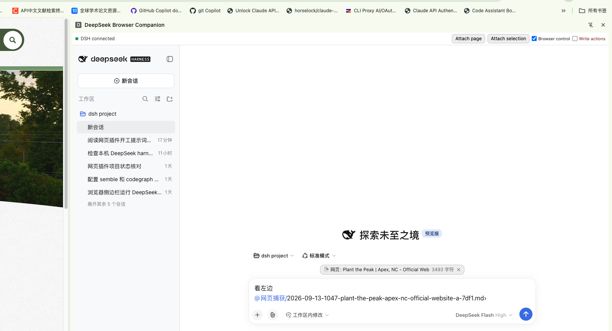

# DSH Browser Companion



**English** (this section) · [中文](#中文) · [Install guide](./docs/13-installation.md) · [安装部署](./docs/13-安装部署.md)

An AI agent that sits **next to the web page you are looking at**, in the Chrome side panel.
It reads the page for you, and — when you turn that on — it also *works* the page: fills forms,
translates, clicks, collects things from several tabs into one place.

It runs on **your own computer** (through DeepSeek Harness). Nothing is sent to a third-party
browser service.

**What you actually do — three things, nothing else:**

1. **Download and unzip it** — see *Step 1* below.
2. **Run two commands** in the Terminal — the wizard asks you before every change, and asks for your
   DeepSeek API key once.
3. **Load the extension in Chrome** — the wizard tells you exactly which folder to pick.

Everything else — *including building the extension* — the wizard does for you. No compiler, no Xcode,
no developer tools: only **Node 22 or newer**.

---

## Background: why I built this

I am **Jerry**. I found that **a browser side panel plus an AI agent** solves a big class of everyday
"doing things on the web" problems — the ones that used to mean copying and pasting back and forth:

- **Filling in forms** — applications, sign-ups, tax and registration forms.
- **Translating a page** — keeping the layout and the terminology consistent, not just word by word.
- **Summarising a long page** — a 50-page policy, a long thread, a documentation page.
- **Collecting from several tabs** — compare one product on three shops, gather addresses from five pages.

At first I used a **Chrome + ChatGPT extension**, and it was genuinely great. But I noticed that
**many people in China cannot use ChatGPT**, while **DeepSeek 4.1 Flash is already very good and is
available in China**. Yet **DeepSeek Harness had no such extension**. So I built this one.

That is the whole reason: the experience I liked, made usable by the people around me, running locally.

---

## What you can do with it

You open the side panel, and you have an agent that can see the page you are on.

- **Ask about the page you are reading.** "What does this contract actually commit me to?" "Summarise this
  in five points." No copying, no pasting — the page is already in front of it.
- **Fill a form.** Give it a form page and tell it what you want to say; it reads each field, understands
  what goes where, and fills it in. It asks you before it changes anything.
- **Translate.** The whole page, or just the part you highlighted — with consistent terminology.
- **Summarise something long.** Long policy pages, forum threads, docs: get the parts that matter, then ask
  follow-up questions about them.
- **Collect from several tabs.** "Compare this product on those three shops." "Get the address from each of
  these five pages." It gathers them into one answer or one table.
- **Hand it what you are looking at, three ways.** The **page**, the **text you selected**, or a
  **screenshot** (for charts, canvases, PDF viewers — things that are not text). There is also a
  right-click menu, and if you type 「看左边」 (or "look left") in the chat it grabs the page in the
  other tab by itself.
- **Let it actually click and type.** Turn on the *write operations* switch and it can fill, click, select,
  scroll and navigate — the things that finish a form or walk through a wizard. Every single one of those
  actions is confirmed by you first, unless you deliberately turn asking off (in which case they are
  refused instead of quietly allowed).

Everything it captures is saved in your workspace as a normal Markdown file, and referenced in the chat as
`@网页捕获/….md` — so you can read, edit, keep or delete it like any other file.

---

## How it works

```text
┌──────────────────────────── Chrome ────────────────────────────┐
│  the page you are on                side panel                 │
│  ┌──────────────┐                  ┌─────────────────────────┐ │
│  │  web page    │                  │ Companion panel         │ │
│  │              │                  │ page / selection / shot │ │
│  └──────┬───────┘                  │ control / write switch  │ │
│         │ reads the page           └───────┬─────────────────┘ │
│         ▼                                  │ shows the DSH UI   │
│  ┌──────────────────────┐         ┌────────▼─────────────────┐ │
│  │ extension background │         │ DSH chat UI (in a frame) │ │
│  └────────┬─────────────┘         └────────┬─────────────────┘ │
└───────────┼────────────────────────────────┼───────────────────┘
            │  local connection              │  local connection
            ▼                                ▼
   ┌──────────────────────────────────────────────────────────┐
   │  DeepSeek Harness — running on your computer             │
   │    └ the Companion plugin (inside DSH)                   │
   │       · talks to the browser                             │
   │       · gives the AI its browser abilities               │
   │       · asks you before any change is made               │
   │       · saves the captures and keeps a local log         │
   └──────────────────────────────────────────────────────────┘
            ▲  lets Chrome start DSH when it is not running
      ┌─────┴──────┐
      │ small      │
      │ launcher   │
      └────────────┘
```

Three small pieces, all on your machine:

1. **The Chrome extension** — the only part that can touch web pages. It is built on your computer when
   you install, with your own settings baked in.
2. **A plugin inside DeepSeek Harness** — it lives in the same process as your local DSH, gives the AI its
   browser abilities, gates the changes, and keeps the log.
3. **A small launcher** — so that clicking the extension can start DeepSeek Harness for you if it is not
   running yet.

### Why it is built this way

The easiest possible version would be: *put DSH in the side panel, type "look left", grab the page text.*
I did not stop there, because that version only *reads*:

- **Reading is not enough.** Filling a form and translating a page are things you *do*. A read-only version
  has nowhere to put "click here", "type this", "wait for the page" — and nowhere to ask you first.
- **One big dump is not always what you want.** Sometimes it is the text you selected, sometimes a picture of
  a chart, sometimes a page made of controls rather than text. So there are three separate ways to hand it
  over, instead of one hidden behaviour.
- **Only the extension can reach the page.** A page shown inside a frame cannot read other tabs or other
  sites. So the extension is the hands, and DeepSeek Harness is the brain.
- **Changes need permission and a record.** Anything that modifies a page goes through a confirmation, and
  every capture is written to a local log. "The AI quietly clicked something" is not acceptable.

---

## Is it safe?

The short version: **it all runs on your computer, and nothing happens without your consent.**

- **No third-party browser service.** Your extension reads the page and hands it to *your* local DSH
  process. There is no company in the middle.
- **Nothing is exposed to the network.** The plugin listens only on your own machine, and does not talk to
  the internet.
- **Only your browser can talk to it.** The connection requires a secret pairing key that is generated on
  your machine, and it checks that the caller really is your extension. A random web page cannot reach it.
- **Your extension's identity is pinned**, so another extension cannot impersonate it.
- **Write operations fail closed.** If asking is not possible — or the session is set to never ask — the
  action is **refused**, and it tells you it was the *setting*, not a person, that said no.
- **Every change is asked for, and recorded**, in a local log you can read.
- **No secrets in this repository**: no keys, no pairing file, no built extension. The build checks this.

---

## Getting it, and installing it

### Step 1 — download it (click by click, no GitHub experience needed)

You do **not** need the green `Code` button, and you do **not** need `git`. GitHub has a page made for
exactly this: **Releases**. Here is what to click.

1. **Open this page** — <https://github.com/jerryxugit-2026/dsh-web-companion/releases>

   (Or open the project page and click **Releases**, in the right-hand column.)

2. You will see the newest entry at the top (currently **v3.47.3**). **Click its title.**

3. On that page, **scroll to the very bottom** — the last section is called **Assets**.
   Under it, click the one that says **`Source code (zip)`**. A `.zip` file starts downloading.
   *(Ignore `Source code (tar.gz)` unless you know you want it; ignore everything above `Assets`.)*

4. Find the downloaded file — usually in **Downloads** — and **double-click it** to unzip.
   You get a folder whose name starts with `dsh-web-companion`.
   Move it somewhere you will find again (your home folder is fine).

*(Comfortable with git? `git clone https://github.com/jerryxugit-2026/dsh-web-companion.git`
gives you the same thing.)*

**What you are downloading (and what you are not)**: only the project's own source. There is **no**
`node_modules`, **no** pre-built extension, and **no** keys inside. That is why the download is small.

### Do I have to compile anything? — No

**There is no build step for you, and nothing gets downloaded behind your back.** You install the two
prerequisites yourself with copy-paste commands (below); the wizard then checks them, tells you exactly
what is missing if anything is, and **builds the Chrome extension for you** (a few seconds). You never
open a compiler, and you do not need Xcode or any developer tools.

**The installer deliberately does not download or install anything.** It used to decide by itself and
pull things in; that turned out to be wrong in practice — on a machine that already had DeepSeek Harness
installed from source, the check only looked at `PATH`, did not see it, and would have installed a
second copy. So now it **reports**: what is missing, where it goes, and the exact command to run. One
exception — the only thing it ever writes for a dependency is a **symlink** to an `esbuild`
you already have, instead of downloading one. And if a dependency is missing it stops **before writing a
single file**.

**Why is the extension not already built inside the download?** Because the build bakes in **your** DSH
port and **your** pairing key. A pre-built copy would simply not work on your machine — so the wizard
builds it locally instead.

### Step 2 — run the installer

You need **macOS**, **Node 22 or newer** and **Chrome**.

**Two things you install yourself first.** The wizard checks them and tells you the exact command if one
is missing — but it will not install them for you:

```bash
# 1. DeepSeek Harness — the host program the plugin lives inside.
#    Pin the version: npm's `latest` for its sub-packages is a broken stub.
npm install -g @deepseek-ai/dsh@0.1.5-rc.2

# 2. esbuild — used once, to build the Chrome extension (~11 MB).
#    The wizard prints the exact command for your folder if it is missing.
npm install --prefix "<the folder you unzipped>/extension" esbuild
```

Already have DeepSeek Harness from a **source checkout** (a `git clone` with no `node_modules`)? That is
source, not a working install — build it first, or leave it alone and install the published package as
above. If you run it from a custom location, point the wizard at its launcher: `--dsh <path-to-dsh>`.

**Getting the Terminal into the right folder (the part everyone gets stuck on):**

1. Press `Cmd + Space`, type `Terminal`, press Enter — a black window opens.
2. Type `cd ` — the letters c, d and **one space** — then **drag the unzipped folder from Finder into
   that window** (the path types itself), and press Enter.
3. Now run:

```bash
node bootstrap/install.mjs          # dry run: it only prints what it *would* change
node bootstrap/install.mjs --apply  # the real thing: it asks you before every step
```

**The one typo nearly everybody makes:** the file is `bootstrap/install.mjs` — with a **slash**,
because `install.mjs` sits *inside* the `bootstrap` folder. `bootstrap.install.mjs` (a dot) is not a
file, and Node answers `Cannot find module`. Let it type itself instead: type `node boot`, press
**Tab** (it completes to `bootstrap/`), type `in`, press **Tab** again, then Enter.

An absolute path also works from any directory:

```bash
node /full/path/to/dsh-web-companion-3.49.1/bootstrap/install.mjs
```

**The wizard will ask you two things before it does anything** — where to install the program, and
where your DSH data lives. Both come with a sensible default, so **just press Enter twice**:

```
? 本程序安装到哪个目录？ [/Users/you/Downloads/dsh-web-companion-3.49.1]   ← press Enter
? DSH 数据目录（配对钥匙/凭据放这里）？ [/Users/you/.dsh]                            ← press Enter
```

(The two prompts are in Chinese — the installer is a terminal program written for this project.

**It installs into the folder you unzipped — that is the default, and it is safe.** The wizard keeps
the sources where they are and adds what it needs next to them (`node_modules`, the built extension,
a launcher). So the program lives in a folder you can see and delete, instead of scattering itself
somewhere you would have to hunt for. If you would rather put it elsewhere, pass `--install-dir <path>`
or type a path at that prompt.)

Then, once:

1. In Chrome, open `chrome://extensions`, turn on **Developer mode**, click **Load unpacked**, and choose
   the `extension/dist` folder the installer just built for you.
2. Click the extension icon to open the side panel — that is your agent's window.
3. Restart DeepSeek Harness (`dsh web`) so it picks up the plugin, then check everything:

```bash
node bootstrap/doctor.mjs           # verifies DSH, pairing, the built extension, connectivity
```

The installer asks you where to install and where your DSH data lives. It checks Node, DSH, Chrome and the
port; installs DSH if it is missing; builds the extension on your machine; adds one line to your DSH
settings (after backing it up); and then verifies the result. To remove it again:
`node bootstrap/uninstall.mjs`.

*(Windows is not supported. The installer says so and stops, rather than pretending.)*

---

## For engineers

Design docs, the changelog and the ledger live in [`docs/`](./docs). The model-facing tools are
`browser_read`, `browser_tabs`, `browser_wait`, `browser_screenshot`, `browser_ax`, plus gated write
operations; the two local channels are `/ag/agent` (extension) and `/ag/client` (DSH page).
`npm run check` runs the whole gate suite; `npm run probe:all` runs the real-Chrome probes.

---

<a id="中文"></a>
# DSH Browser Companion（中文）

**English**（见上） · **中文**（本节） · [安装说明](./docs/13-installation.md) · [安装部署](./docs/13-安装部署.md)

一个 AI agent，就坐在**你正在看的网页旁边** —— 在 Chrome 侧边栏里。它替你读页面，在你同意时也替你**操作**页面：
填表、翻译、点击、把好几个标签页里的东西收拢到一处。

它跑在**你自己的电脑上**（通过 DeepSeek Harness），网页不需要交给任何第三方的浏览器服务。

**你实际要做的 —— 只有 3 件事：**

1. **下载并解压** —— 见下面「第一步」。
2. **在终端运行两条命令** —— 向导每改一处都会先问你，并会问你一次 DeepSeek API key。
3. **在 Chrome 里加载扩展** —— 向导会告诉你具体该选哪个文件夹。

其余全部（**包括构建扩展**）都由向导自己做。不需要编译器、不需要 Xcode、不需要开发者工具，
**只需要装好 Node 22 或更高版本**。

---

## 开发背景：为什么做这个

我是 **Jerry**。我发现**浏览器侧边栏 + AI agent** 能解决一大类"上网办事"的问题 —— 那些以前只能来回复制粘贴的事：

- **填表** —— 申请、注册、报税与登记类表单。
- **翻译网页** —— 保持版式与术语一致，而不是逐词硬翻。
- **长页面总结** —— 几十页的条款、很长的帖子、一篇文档。
- **跨标签页收集** —— 在三家店比一个商品、从五个页面里收地址。

我最开始用的是 **Chrome + ChatGPT 的插件**，**确实非常好用**。但我发现**很多人在国内无法使用 ChatGPT**，
而 **DeepSeek 4.1 Flash 已经非常好用、国内可以直接用**。可是 **DeepSeek Harness 没有这样的扩展程序**。
于是我自己做了这个。

理由就这么简单：把我喜欢的那种体验，做成身边的人能用、而且跑在本地的东西。

---

## 你能让它做什么

点开侧边栏，你就有了一个看得见当前页面的 agent。

- **就着当前页面问它。** "这份合同到底让我承担了什么？""用五句话总结这一页。" 不用复制粘贴，页面已经在它眼前。
- **替你填表。** 给它一个表单页，告诉它你想写什么；它读懂每个字段要什么，然后填好。**动手之前会先问你。**
- **翻译。** 整页翻，或只翻你划中的那段 —— 术语前后一致。
- **总结长内容。** 长条款、长帖、文档：只给要紧的部分，然后可以就着它追问。
- **跨标签页收集。** "把这个商品在那三家店比一下。""从这五个页面里把地址取出来。" 它会汇总成一段答案或一张表。
- **把你在看的东西交给它，三种方式。** **整页**、**你划中的文字**、或**截图**（图表、canvas、PDF 阅读器这类不是文字的东西）。
  也有右键菜单；在对话里打「看左边」（或 "look left"），它会自己把另一个标签页抓过来。
- **让它真的动手。** 打开**写操作**开关，它就能填、点、选、滚、跳 —— 那些能真正填完一张表、走完一个向导的动作。
  这些动作**每一个都先经过你确认**；除非你特意关掉询问（那样它们会被**当场拒绝**，而不是偷偷放行）。

它抓到的内容会作为普通 Markdown 文件存在你的工作目录里，并在对话中以 `@网页捕获/….md` 引用 ——
你可以像对待任何文件一样读它、改它、留着或删掉。

---

## 它是怎么工作的

```text
┌──────────────────────────── Chrome ────────────────────────────┐
│  你正在看的网页                      侧边栏                     │
│  ┌──────────────┐                  ┌─────────────────────────┐ │
│  │   网页        │                  │ Companion 面板          │ │
│  │              │                  │ 页面 / 选区 / 截图      │ │
│  └──────┬───────┘                  │ 浏览器控制 / 写操作开关 │ │
│         │ 读取页面                  └───────┬─────────────────┘ │
│         ▼                                  │ 显示 DSH 界面      │
│  ┌──────────────────────┐         ┌────────▼─────────────────┐ │
│  │ 扩展的后台            │         │ DSH 对话界面（在框里）   │ │
│  └────────┬─────────────┘         └────────┬─────────────────┘ │
└───────────┼────────────────────────────────┼───────────────────┘
            │  本机连接                       │  本机连接
            ▼                                ▼
   ┌──────────────────────────────────────────────────────────┐
   │  DeepSeek Harness —— 跑在你的电脑上                       │
   │    └ Companion 插件（在 DSH 进程内）                      │
   │       · 与浏览器通信                                      │
   │       · 给 AI 浏览器能力                                  │
   │       · 任何改动之前先问你                                │
   │       · 保存抓取内容并留一份本机日志                       │
   └──────────────────────────────────────────────────────────┘
            ▲  让 Chrome 在 DSH 没跑时把它拉起来
      ┌─────┴──────┐
      │ 小启动器    │
      └────────────┘
```

三块小东西，全在你机器上：

1. **Chrome 扩展** —— 唯一能碰网页的部分。安装时**在你的电脑上现场构建**，把你的设置烤进去。
2. **DeepSeek Harness 里的插件** —— 和你的本机 DSH 同一个进程：给 AI 浏览器能力、给改动把关、留日志。
3. **一个小启动器** —— DSH 没在跑时，点扩展就能把它拉起来。

### 为什么做成这个结构

最省事的版本是：*把 DSH 放进侧边栏，打一句「看左边」，把页面文字抓过来*。我没有停在那里，因为那个版本只会**读**：

- **光读不够。** 填表和翻译都是你要**做**的事。只读的版本没有地方安放"点这里""输入这个""等页面加载"，
  也没有地方先问你一句。
- **整页一把抓不总是你要的。** 有时要的是你划中的文字，有时要一张图表的截图，有时页面是由控件而不是文字拼成的。
  所以是三种各自独立的交付方式，而不是一个藏在背后的行为。
- **只有扩展能碰到页面。** 框里显示的页面读不到别的标签页、读不到别的网站。所以扩展当"手"，DeepSeek Harness 当"脑"。
- **改动需要许可与留痕。** 任何会修改页面的动作都走一次确认，每次抓取都写进本机日志。
  "AI 悄悄点了什么"是不可接受的。

---

## 它安全吗

一句话：**全部跑在你的电脑上，没有你的同意就什么都不做。**

- **不经过第三方浏览器服务。** 扩展读到页面后交给你**本机**的 DSH 进程，中间没有厂商。
- **不对外暴露网络。** 插件只监听你自己的机器，不与互联网通信。
- **只有你的浏览器能跟它说话。** 连接需要一把在你机器上生成的配对钥匙，并校验对方确实是你那个扩展。
  随便一个网页连不上它。
- **扩展身份是钉死的**，别的扩展冒充不了。
- **写操作 fail-closed。** 问不成、或会话被设成"从不询问"时，动作会**被拒绝**，并告诉你是**设置**拒绝的。
- **每次改动都先问、且留痕** —— 本机日志可查。
- **仓库里没有任何机密**：没有钥匙、没有配对文件、没有构建产物。构建门禁会扫这些。

---

## 怎么下载、怎么安装

### 第一步：下载（一步步点，不需要用过 GitHub）

**不要**点绿色的 `Code` 按钮，也**不需要** `git`。GitHub 有一个专门给这件事的页面叫 **Releases**。
你要点的就是下面这几下：

1. **打开这个页面** —— <https://github.com/jerryxugit-2026/dsh-web-companion/releases>

   （或者打开项目主页，在**右侧栏**点 **Releases**。）

2. 你会看到**最上面那一条**（当前是 **v3.47.3**），**点它的标题**。

3. 进去后**拉到页面最下面**，最后一块区域叫 **Assets**。在它下面点 **`Source code (zip)`**
   那一项，浏览器就开始下载一个 `.zip`。
   *（除非你明确知道自己要，否则**不要**选 `Source code (tar.gz)`；`Assets` 上面那些内容也都不用管。）*

4. 找到刚下载的文件（通常在**下载**文件夹），**双击解压**。你会得到一个名字以
   `dsh-web-companion` 开头的文件夹。把它挪到你找得到的地方（比如你的主目录）。

*（熟悉 git 的话，`git clone https://github.com/jerryxugit-2026/dsh-web-companion.git`
拿到的是同一份东西。）*

**你下载到的（以及没有下载到的）**：只有项目自己的源码。里面**没有** `node_modules`、**没有**预先构建好的扩展、
**没有**任何钥匙。所以下载包很小。

### 需要我自己「编译」吗？—— 不需要

**没有需要你做的编译步骤，也不会有东西在你不知情时被下载。** 两个前置依赖由你自己用一条可复制的
命令装好（见下），向导只负责检查它们、缺什么就明确告诉你、然后**替你构建 Chrome 扩展**（只要几秒）。
你不用打开任何编译器，也不需要 Xcode 或任何开发者工具。

**安装器是故意不下载、不安装任何东西的。** 它原来会自己判断、自己去下 —— 实测下来这是错的：
有台机器上 DeepSeek Harness 是用**源码**装的，而检查只看 `PATH`，没看见它，于是差点又装一份全局的。
所以现在它只**报告**：缺什么、装到哪、跑哪条命令。唯一的例外是：一旦发现关键依赖缺失，它会
**在写任何一个文件之前就停下来**。依赖层唯一的例外是：本机已经有一份 `esbuild` 时，它建一个**符号链接**过去复用，
而不是下载。

**为什么下载包里不直接放构建好的扩展？** 因为构建会把**你的** DSH 端口和**你的**配对钥匙烤进去；
预构建的副本在你机器上根本跑不起来，所以由向导在本机替你构建。

### 第二步：运行安装器

需要 **macOS**、**Node 22 或更高**、**Chrome**。

**有两个东西要你自己先装好。** 向导会检查它们、缺了就告诉你确切的命令 —— 但它**不会替你装**：

```bash
# 1. DeepSeek Harness —— 插件寄宿的那个宿主程序。
#    版本要钉死：它在 npm 上的 `latest` 子包是个跑不起来的 stub。
npm install -g @deepseek-ai/dsh@0.1.5-rc.2

# 2. esbuild —— 只在构建 Chrome 扩展时用一次（约 11 MB）。
#    缺了的话，向导会连你的路径一起把确切命令打出来。
npm install --prefix "<你解压出来的那个文件夹>/extension" esbuild
```

已经有一份**源码**形式的 DeepSeek Harness（`git clone` 下来、没有 `node_modules`）？那是源码，
不是能跑的安装 —— 先把它装起来，或者干脆不管它、按上面装官方发布的包。如果你的 DSH 跑在自定位置，
用 `--dsh <dsh 的路径>` 点给向导。

**怎么让终端进到那个文件夹（大多数人卡在这一步）：**

1. 按 `Cmd + 空格`，输入 `Terminal`（终端），回车 —— 会开一个黑窗口。
2. 先输入 `cd` 再加**一个空格**，然后**把刚才解压出来的文件夹从访达（Finder）拖进这个窗口**
   （路径会自己填上），按回车。
3. 然后运行：

```bash
node bootstrap/install.mjs          # dry run：只打印"打算"改哪些文件
node bootstrap/install.mjs --apply  # 真装：每一步都会先问你
```

**几乎所有人都会打错的一个地方**：是 `bootstrap/install.mjs` —— 中间是**斜杠**，因为 `install.mjs`
在 `bootstrap` **文件夹里面**。写成 `bootstrap.install.mjs`（点）就不是文件了，node 会回你
`Cannot find module`。省事的办法是让终端替你补全：输入 `node boot`，按 **Tab**（自动补成 `bootstrap/`），
再输入 `in`，再按 **Tab**，回车。

用绝对路径也行（在任何目录下都能跑）：

```bash
node /你的完整路径/dsh-web-companion-3.49.1/bootstrap/install.mjs
```

**向导在动手之前会问你两件事** —— 程序装到哪、DSH 数据目录在哪。两个都有合适的默认值，
**直接按两次回车就行**：

```
? 本程序安装到哪个目录？ [/Users/你/Downloads/dsh-web-companion-3.49.1]   ← 回车
? DSH 数据目录（配对钥匙/凭据放这里）？ [/Users/你/.dsh]             ← 回车
```

（**它就装在你解压出来的那个文件夹里 —— 这是缺省值，而且是安全的。** 向导把源码留在原地，
只把需要的东西加到旁边（`node_modules`、构建出的扩展、拉起器）。这样程序就在一个你看得见、删得掉的
文件夹里，而不是散落到某个你还得去找的地方。想装到别处，就加 `--install-dir <路径>`，或者在那个
提示处直接输入路径。）

然后一次性的事：

1. Chrome 里打开 `chrome://extensions`，开启**开发者模式**，点**加载已解压的扩展程序**，
   选安装器刚为你构建出来的 `extension/dist` 文件夹。
2. 点扩展图标打开侧边栏 —— 那就是 agent 的窗口。
3. 重启 DeepSeek Harness（`dsh web`）让它加载插件，然后自检：

```bash
node bootstrap/doctor.mjs           # 检查 DSH、配对、构建产物、连通性
```

安装器会问你装到哪、DSH 数据目录在哪；检查 Node、DSH、Chrome 与端口；DSH 缺了就替你装；
在你的机器上现场构建扩展；往你的 DSH 设置里加一行（改前先备份）；最后自证一遍。
想卸掉：`node bootstrap/uninstall.mjs`。

*（不支持 Windows。安装器会明确说明并**当场停下**，而不是假装成功。）*

---

## 给工程师

设计文档、变更记录与台账在 [`docs/`](./docs)。面向模型的工具是 `browser_read`、`browser_tabs`、
`browser_wait`、`browser_screenshot`、`browser_ax`，以及受闸门保护的写操作；两条本机通道是
`/ag/agent`（扩展侧）与 `/ag/client`（DSH 页面侧）。`npm run check` 跑全部门禁，`npm run probe:all` 跑真 Chrome 探针。
