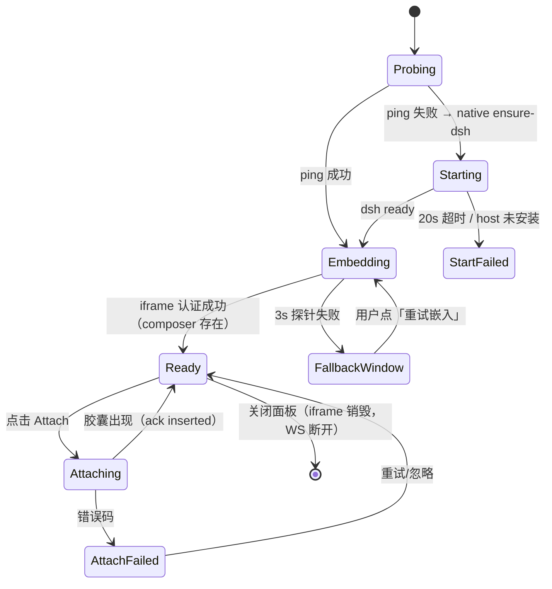

# 02 · Chrome 扩展设计（`extension/`）

**产物**：Manifest V3 扩展 `antigravity-web-companion`
**运行形态**：Service Worker（后台）+ Side Panel（侧边栏）+ Content Script（网页注入）
**依赖**：无重型运行时；仅 `protocol`（codegen）、可选 `@mozilla/readability` + `turndown`（离线打包，M2 引入）

---

## 1. 目录与文件职责

```
extension/
├── manifest.json                  # MV3 声明（含固定扩展 ID 的 key）
├── src/
│   ├── sw/
│   │   ├── index.js               # SW 入口：装配所有监听器（唯一副作用入口）
│   │   ├── dsh-session.js         # DSH 存活探测 / 握手 URL / 降级决策
│   │   ├── native-host.js         # native messaging 客户端（拉起 dsh web）
│   │   ├── agent-bridge.js        # WS /ag/agent：工具调用执行器 + 重连
│   │   ├── capture.js             # 抓取编排（page/selection/screenshot）
│   │   ├── attach-sender.js       # POST /ag/attach + 结果回传面板
│   │   ├── panel-control.js       # 侧边栏/独立窗口开关与状态广播
│   │   ├── commands.js            # 快捷键、右键菜单
│   │   ├── settings.js            # 配置读写（chrome.storage.local）
│   │   ├── ops/                   # 浏览器操作实现（与 agent-bridge 解耦，纯逻辑）
│   │   │   ├── read.js  screenshot.js  click.js  type.js  navigate.js  tabs.js  wait.js
│   │   └── log.js                 # 结构化日志（脱敏）
│   ├── sidepanel/
│   │   ├── panel.html panel.css
│   │   ├── panel.js               # UI 装配与 SW 消息通道
│   │   ├── iframe-host.js         # iframe 生命周期 / 加载失败检测 / 降级到窗口
│   │   ├── toolbar.js             # [Attach 网页 ▾] 与上下文胶囊列表
│   │   └── state.js               # 面板状态机（dsh / attach 两个维度）
│   ├── content/
│   │   ├── content.js             # ISOLATED：选区监听、浮标、与 SW 通信
│   │   ├── extract.fn.js          # MAIN world 注入函数（序列化后注入，必须自包含）
│   │   └── markdown.js            # HTML→Markdown 纯函数（可单测）
│   ├── lib/
│   │   ├── protocol.generated.js  # codegen 产物
│   │   ├── urls.js                # 回环 URL 构造（ping/enter/attach）
│   │   ├── cookie.js              # chrome.cookies 封装（set/remove/verify）
│   │   ├── result.js              # Result<T,E> 统一错误模型
│   │   └── ids.js                 # ULID 生成
│   └── assets/ icon-16/32/48/128
├── tests/
│   ├── unit/                      # vitest + jsdom（见 §6）
│   ├── fakes/chrome.js            # chrome API 假实现（可断言调用参数）
│   └── fixtures/*.html|*.json
└── build.mjs                      # esbuild 打包（可选：M1 直接手写 ESM，免构建）
```

**构建策略**：M1 直接用原生 ESM + `type:"module"` service worker（无需打包）；M2 引入 readability/turndown 后加 `build.mjs`（esbuild，`--bundle --format=esm`，产出 `dist/`）。

---

## 2. manifest.json（骨架与权限理由）

```json
{
  "manifest_version": 3,
  "name": "Antigravity Web Companion",
  "version": "0.1.0",
  "key": "<固定扩展 ID 的公钥，安装脚本写入>",
  "minimum_chrome_version": "116",
  "background": { "service_worker": "src/sw/index.js", "type": "module" },
  "side_panel": { "default_path": "src/sidepanel/panel.html" },
  "action": { "default_title": "Antigravity Companion" },
  "permissions": [
    "sidePanel", "storage", "cookies", "scripting", "activeTab", "tabs",
    "contextMenus", "nativeMessaging", "alarms"
  ],
  "optional_permissions": ["debugger"],
  "optional_host_permissions": ["*://*/*"],
  "host_permissions": ["http://127.0.0.1:3080/*"],
  "content_scripts": [
    { "matches": ["http://127.0.0.1:3080/*"], "js": ["src/content/content.js"], "all_frames": true, "run_at": "document_idle" }
  ],
  "commands": {
    "toggle-panel": { "suggested_key": { "mac": "Command+Shift+G" }, "description": "打开/聚焦 Antigravity 侧边栏" },
    "attach-page":  { "suggested_key": { "mac": "Command+Shift+E" }, "description": "Attach 当前网页" }
  }
}
```

权限理由（评审要点）：

| 权限 | 为什么必须 | 可否省略 |
|---|---|---|
| `sidePanel` | 侧边栏容器 | 不可 |
| `cookies` | 安装 `SameSite=None; Secure` 会话 cookie（实证必需） | 不可 |
| `scripting` + `activeTab` | 抓正文/选区；浏览器操作工具 | 不可 |
| `tabs` | `captureVisibleTab`、工具桥定位标签页 | 不可 |
| `nativeMessaging` | 自动拉起 `dsh web`（G4） | 可（降级为手动启动） |
| `debugger` | 仅 M3 增强（全页截图、网络、控制台）；**optional**，运行时按需申请 | 可 |
| `host_permissions: 127.0.0.1:3080/*` | 与桥接插件通信 + 在 DSH 页面注入 content script | 不可 |
| `optional_host_permissions: *://*/*` | **仅**用于 M4 的「网页内悬浮胶囊 + 划词浮标」（PRD FR-1.2）常驻注入；用户在设置页显式授予后才申请 | 可（不授予则该功能不出现） |
| 任意网页抓取 | 走 `activeTab`（用户点击时临时授权）+ `scripting.executeScript`，**默认不申请 `<all_urls>`** | — |

> 设计取舍：**默认权限最小化**——安装时只拿到 `127.0.0.1:3080` 与 `activeTab`。PRD FR-1.2 的常驻悬浮胶囊/划词浮标需要跨站常驻注入，因此放在**可选权限**里由用户显式开启；未开启时通过「点击工具栏图标 → 抓取当前页」达到同样的效果。

---

## 3. 模块级设计：函数、输入输出、错误

> 约定：所有函数返回 `Result<T>`：`{ok:true, value:T}` 或 `{ok:false, error:{code,message,detail?}}`；错误码见 docs/01 §2.6。所有对外 API 调用都带超时（默认见各函数）。

### 3.1 `src/sw/index.js`（SW 入口）

| 函数 | 职责 | 输入 | 输出 | 错误 |
|---|---|---|---|---|
| `onInstalled(details)` | 首次安装：写入默认配置、生成/校验 key、注册右键菜单、`sidePanel.setPanelBehavior({openPanelOnActionClick:true})` | `chrome.runtime.InstalledDetails` | `Promise<void>` | 失败仅记录日志（不阻断） |
| `onMessage(msg, sender)` | 统一路由（见 docs/01 §5），异步返回 | 消息 + sender | `Promise<Result>` | 未知 `kind` → `E_PAYLOAD` |
| `onCommand(cmd)` | 处理快捷键：`toggle-panel` / `attach-page` | command | `Promise<void>` | — |
| `onAlarm(alarm)` | `keepalive`（30s）：确保 `agent-bridge` 在线 | `chrome.alarms.Alarm` | `Promise<void>` | 重连失败不抛 |
| `boot()` | 幂等初始化（监听器只注册一次） | — | `void` | — |

**接线**：`boot()` 在任何监听器注册前调用；所有业务逻辑放入被 `await import()` 的模块，避免 SW 冷启动时全量加载（MV3 冷启动性能）。

### 3.2 `src/sw/dsh-session.js`

| 函数 | 签名 | 行为 | 测试点 |
|---|---|---|---|
| `probe(port, timeoutMs=1500)` | `Promise<Result<PingInfo>>` | `GET /ag/ping?key=…`，用 `AbortController` 超时 | 200/403/超时/版本不匹配 四种分支 |
| `ensureRunning(settings)` | `Promise<Result<{url,started,pid?}>>` | `probe` 失败 → 调 `native-host.ensureDsh()`；成功后再次 `probe`；总计 20s 上限 | 已运行/自动拉起成功/拉起失败/超时 |
| `enterUrl(port, key)` | `string` | `http://127.0.0.1:<port>/ag/enter?key=<key>` | 拼接正确、key 不在 URL 日志外泄漏 |
| `installCookie(port, cookieSpec)` | `Promise<Result<void>>` | 兜底路径：`chrome.cookies.set({url, name, value, sameSite:'no_restriction', secure:true})` | 属性正确（`no_restriction` + `secure:true`） |
| `verifyEmbed()` | `Promise<Result<{authed:boolean}>>` | 在 iframe 上下文不可直接读取 → 由面板注入探针 + `chrome.scripting.executeScript(allFrames)` 读取 `document.title`/composer 存在性判定 | 认证成功/401 页面/加载失败 三态 |

> **关键实现注意**：`/ag/enter` 必须由 iframe **导航**触发（服务端 Set-Cookie），不要用 `fetch` 取 cookie 再 `cookies.set`——后者拿不到 `HttpOnly`，虽然服务端不校验该标志，但导航方式更贴近浏览器语义且无需把 cookie 值送进扩展。`installCookie` 仅作为服务端不可用时的回退（skill=专家模式）。

### 3.3 `src/sw/native-host.js`

| 函数 | 签名 | 行为 | 测试点 |
|---|---|---|---|
| `ensureDsh({profile,port,timeoutMs})` | `Promise<Result<NativeEnsureResult>>` | `runtime.connectNative(HOST_NAME)` → 发 `ensure-dsh` → 等响应 → **主动 disconnect**（不常驻，规避 SW 回收） | 正常/端口被占用/host 未安装/1MB 溢出 |
| `status()` / `stopDsh(pid)` / `getInfo()` | 同上 | 对应 cmd | 幂等性 |
| `callNative(cmd,args,timeoutMs=25000)` | `Promise<Result<T>>` | 统一封装：写帧、读帧、超时断开、错误映射 | 帧解析（长度前缀）、超时、`runtime.lastError` |

错误映射：`chrome.runtime.lastError.message` 含 `Specified native messaging host not found` → `E_NATIVE_MISSING`（面板提示「请先运行 scripts/install-native-host.mjs」）。

### 3.4 `src/sw/capture.js`

| 函数 | 签名 | 输入 | 输出 | 说明 |
|---|---|---|---|---|
| `capturePage(tabId)` | `Promise<Result<PageCapture>>` | tab | `{title,url,domain,capturedAt,markdown,meta}` | `scripting.executeScript({world:'MAIN', func:extractFn})`；失败回退 `world:'ISOLATED'` + `markdown.js` |
| `captureSelection(tabId)` | `Promise<Result<SelectionCapture>>` | tab | `{text, rect, selectorHint}` | 先向 content script 取缓存选区，取不到再注入读取 |
| `captureScreenshot(windowId)` | `Promise<Result<Screenshot>>` | — | `{mime,base64,width,height,scale}` | `chrome.tabs.captureVisibleTab(windowId,{format:'png'})`；面板聚焦时先 `chrome.windows.update(focused:true)` |
| `buildPayload(mode, parts)` | `Payload` | 三态组合 | docs/01 §2.3 请求体 | 纯函数，便于单测 |
| `truncateMarkdown(md, maxChars=120000)` | `string` | — | 截断 + `truncated:true` | 纯函数 |

**抓取算法（extract.fn.js 内自包含）**：
1. 若存在 `article, main, [role=main]` → 以其为根，否则 `document.body`；
2. 移除 `script,style,nav,footer,header,aside,[aria-hidden=true],.ad,.ads`；
3. 遍历保留 `h1-h6,p,li,pre>code,table,blockquote,img[alt]`；
4. 产出 Markdown（`markdown.js`：标题层级、列表嵌套、代码块语言标注、链接 `[text](href)` 绝对化、图片 ``）；
5. 元数据：`title`、`location.href`、`document.querySelector('meta[name=description]')`、`og:*`、`capturedAt`。

### 3.5 `src/sw/attach-sender.js`

| 函数 | 签名 | 行为 | 测试点 |
|---|---|---|---|
| `send(payload)` | `Promise<Result<AttachResult>>` | `POST /ag/attach`，8s 超时，413/409/500 映射错误码 | 各错误码映射、成功后广播 `state.attach='attached'` |
| `retry(payload, n=2)` | 同上 | 仅对 `E_TIMEOUT`/网络错误重试，指数退避 300/900ms | 不重试 4xx |

### 3.6 `src/sw/agent-bridge.js`

| 函数 | 签名 | 行为 | 测试点 |
|---|---|---|---|
| `connect()` | `Promise<Result<void>>` | `new WebSocket('ws://127.0.0.1:<port>/ag/agent?key=…')`，Origin 自动为扩展来源 | 连接成功/403 拒绝/端口未开 |
| `keepAlive()` | `void` | 收到 `ping` 回 `pong`；断线 → 指数退避重连（1s→2s→…→30s 上限） | 心跳、退避序列（假时钟） |
| `handle(req)` | `Promise<void>` | 按 `op` 分发到 `ops/*`，把结果/错误封装为 `response` 帧 | 未知 op → `E_PAYLOAD`；超时 → `E_TIMEOUT` |
| `resolveTab(args)` | `Promise<Result<number>>` | `args.tabId` → 校验存在；否则 `tabs.query({active:true,currentWindow:true})` | 指定/活动/无标签页 |
| `dispose()` | `void` | 关闭 socket、清定时器（SW 卸载前调用） | 幂等 |

`ops/*` 每个模块导出 `async function run(ctx, args): Promise<Result<ResultShape>>`，`ctx = {chrome, resolveTab, log}`，**不直接引用全局 `chrome`**，以便单测注入假实现。

| op 模块 | 关键实现 | 单测要点 |
|---|---|---|
| `read.js` | 注入函数返回 `{title,url,text,selection}`，`maxChars` 截断 | 截断边界、选区为空 |
| `screenshot.js` | `captureVisibleTab`（M3 起支持 `fullPage` → debugger `Page.captureScreenshot{capatureBeyondViewport}`） | 权限缺失的错误映射 |
| `click.js` | 优先 `document.querySelector(selector)` → `el.click()`；未命中且给了 `text` → 按可见文本匹配；跨 iframe 用 `allFrames:true` 汇总候选 | 命中 0/1/多、坐标回传、不可点击元素回退 |
| `type.js` | 聚焦 → 原生 value setter → `input`/`change` 事件 → 可选 `Enter` 提交 | React 受控组件、contenteditable 分支 |
| `navigate.js` | `tabs.update` + 等待 `tabs.onUpdated.status==='complete'`（超时可控） | 超时、重定向后的 `finalUrl` |
| `tabs.js` | `tabs.query({})` 投影为精简结构 | 字段裁剪（不泄漏 cookie/权限字段） |
| `wait.js` | 轮询注入（`setTimeout` 间隔 150ms，总超时） | 命中快照、超时错误码 `E_TIMEOUT` |

### 3.7 `src/sw/panel-control.js`

| 函数 | 签名 | 行为 | 测试点 |
|---|---|---|---|
| `openPanel(windowId)` | `Promise<Result<void>>` | `chrome.sidePanel.open({windowId})`（必须由用户手势触发） | 无手势时错误处理 |
| `openFallbackWindow(url)` | `Promise<Result<number>>` | `chrome.windows.create({url,type:'popup',width:460,height:900})` | 返回 windowId 并记录 |
| `broadcast(state)` | `void` | 向所有面板/窗口发 `{kind:'state'}` | 无接收者不报错 |

### 3.8 `src/sidepanel/*`

| 文件 | 函数 | 职责 |
|---|---|---|
| `panel.js` | `init()` | 装配：读设置 → `ensure-dsh` → 渲染工具栏 → 建 iframe |
| | `onState(next)` | 驱动 UI（四态：`dsh:down/starting/up` × `attach:idle/sending/attached/failed`） |
| | `onAttachClick(mode)` | 发 `{kind:'capture',mode}`，按钮进入 loading，成功后加胶囊 |
| `iframe-host.js` | `mount(url)` | 建 iframe（`allow="clipboard-read; clipboard-write"`），挂 `load`/`error` 监听 |
| | `detectAuthFailure()` | iframe `load` 后 3s 通过 `chrome.scripting` 在 DSH 帧内探针（读 `document.title`、composer 存在性）判定；失败 → `fallback()` |
| | `fallback()` | 调 `openFallbackWindow(enterUrl)`，面板显示「已在独立窗口打开」+「重试嵌入」按钮 |
| `toolbar.js` | `render()` | 渲染 `[Attach 网页 ▾]`（page/selection/screenshot 三项）、工作区提示、DSH 状态点 |
| | `renderChips(items)` | 上下文胶囊列表（`[📄 网页: React 19 Docs ✕]`），✕ 触发 `POST /ag/ack {status:'dismissed'}` |
| `state.js` | `createStore()` | 极简 store：`getState/dispatch/subscribe`，纯逻辑便于单测 |

**胶囊数据来源**：`toolbar.js` 只消费 client 插件回传的 `attach` 事件（经 SW 转发）或 `POST /ag/attach` 的返回；**不重复抓取**。

### 3.9 `src/content/*`

| 文件 | 函数 | 世界 | 职责 |
|---|---|---|---|
| `content.js` | `trackSelection()` | ISOLATED | `selectionchange` 去抖 150ms，缓存 `{text, rect}`；`hasSelection` 供 SW 查询 |
| | `showFloatingPill()` | ISOLATED | 选区非空时在 `rect` 旁渲染 `Ask Antigravity` 浮标（Shadow DOM 隔离样式），点击 → `sendMessage({kind:'attach-selection'})` |
| | `onMessage(msg)` | ISOLATED | 响应 `get-selection` / `ping` / `insert-into-composer`（后者仅用于 v1.1 快路径） |
| `markdown.js` | `htmlToMarkdown(node)` | 任意 | 纯函数（见 §3.4 规则），零 DOM 之外依赖，可在 jsdom 下单测 |
| `extract.fn.js` | `default export function extractPage()` | MAIN | 必须**自包含**（`executeScript` 序列化注入），不得引用模块外变量；返回 `{title,url,markdown,meta}` |

---

## 4. 关键接线清单（实现时逐条对照）

1. `action.onClicked` → 若 `openPanelOnActionClick` 已生效则无需处理；否则 `openPanel(lastFocusedWindowId)`。
2. `sidePanel.setPanelBehavior({openPanelOnActionClick:true})` 必须在 `onInstalled` 中调用一次。
3. `chrome.tabs.captureVisibleTab` 只能作用于**当前窗口的活动标签页**；调用前面板需让出焦点（`chrome.windows.update(windowId,{focused:true})`）。
4. `chrome.scripting.executeScript` 的 `func` 不能是箭头函数闭包引用外部变量；统一从 `extract.fn.js` 取函数引用与显式 `args`。
5. `nativeMessaging` 的 port 与 SW 同生命周期：**每次调用新建、用完即断**，并把 DSH 进程 `detached` 化，保证 SW 回收不影响 DSH。
6. content script 需 `all_frames:true`，否则侧边栏 iframe 内的 DSH 页面收不到注入（也用于「独立窗口/普通标签页」两种降级形态的统一寻址）。
7. 面板与 iframe 的通信：面板**不直接** `postMessage` 到 iframe 作为主通道（v1 走桥接 WS），仅在 v1.1 作为低延迟快路径。
8. cookie 相关操作只允许发生在 `http://127.0.0.1:<port>/` 这个 origin 上；设置前先 `chrome.cookies.remove({url,name})` 清理旧值。

---

## 5. 面板状态机



---

## 6. 单元测试设计（`extension/tests/unit/`）

运行：`npm run test`（vitest + jsdom，`--environment jsdom` 仅对 DOM 相关用例）。
假实现：`tests/fakes/chrome.js` 提供 `cookies/sidePanel/scripting/tabs/runtime/windows/storage/alarms/nativeMessaging` 的**可断言 stub**（记录调用参数、可编程返回/抛错/触发事件）。

| 测试文件 | 覆盖单元 | 关键用例（≥） |
|---|---|---|
| `markdown.test.js` | `content/markdown.js` | ①标题层级 ②嵌套列表 ③代码块+语言 ④相对链接绝对化 ⑤表格 ⑥图片 alt 缺失 ⑦`<script>` 剔除 ⑧中文/emoji 不被转义破坏（≥8） |
| `extract.test.js` | `extract.fn.js`（jsdom 加载 `fixtures/*.html`） | ①article 优先 ②无 article 回退 body ③噪音剔除 ④元数据 ⑤超长截断（≥5） |
| `dsh-session.test.js` | `probe/ensureRunning/enterUrl` | ①200 → ok ②403 → `E_AUTH` ③超时 → 调 native ④native 失败 → 明确错误 ⑤版本不匹配 → `E_VERSION`（≥5） |
| `native-host.test.js` | `callNative/ensureDsh` | ①帧编解码往返 ②超时断开 ③`lastError` → `E_NATIVE_MISSING` ④响应 id 不匹配 → 丢弃（≥4） |
| `capture.test.js` | `buildPayload/truncateMarkdown/capture*` | ①三种 mode 的组合 ②截图失败不影响正文 ③MAIN 注入失败回退 ISOLATED ④截断标记（≥4） |
| `attach-sender.test.js` | `send/retry` | ①200 → 结果 ②400/413/409 → 对应错误码 ③`E_TIMEOUT` 重试 2 次 ④4xx 不重试（≥4） |
| `agent-bridge.test.js` | `connect/keepAlive/handle/resolveTab` | ①hello 帧 ②ping→pong ③退避序列（假时钟）④未知 op ⑤超时 ⑥tabId 不存在（≥6） |
| `ops-click.test.js` 等 7 个 | 各 `ops/*` | 每 op 至少：命中、未命中、权限/超时三类（≥3 × 7） |
| `state.test.js` | `sidepanel/state.js` | ①迁移表 ②非法迁移忽略 ③订阅通知（≥3） |
| `cookie.test.js` | `lib/cookie.js` | ①set 属性 `no_restriction`+`secure` ②remove 先于 set ③失败→`E_AUTH`（≥3） |
| `protocol-sync.test.js` | `lib/protocol.generated.js` | ①头部 sha256 与 schema 一致 ②valid 向量全过 ③invalid 向量全拒（≥3） |

覆盖率门槛：`src/lib`、`src/sw/ops`、`content/markdown.js` 行覆盖 ≥ 85%，其余 ≥ 70%。

**Chrome API 不可单测的部分**（`captureVisibleTab`、真实 `sidePanel.open`、`scripting` 真注入、native messaging 真进程）全部交给 E2E（docs/06），单测只断言「调用参数正确 + 错误被映射」。

---

## 7. 平台约束修正（来自 docs/research/03，已并入设计）

| 项 | 约束 | 对设计的影响 |
|---|---|---|
| 侧边栏不能承载远程 URL | `PanelOptions.path` 必须是扩展包内本地资源 | iframe 是**必须**，不是可选优化；面板页只做宿主与状态条 |
| 侧边栏宽度 | `kSidePanelDefaultContentWidth = 360` 即默认也是最小内容宽度 | 按 **360–420px** 设计；DSH 原生 UI 在 420px 下已实测正常（侧栏收成图标） |
| per-tab 面板 | 切到未启用该面板的标签页会被隐藏；同 path 也是**不同实例** | 只用**单个全局面板**（不做 per-tab） |
| **Service Worker 生命周期** | 空闲 **30s** 回收；116+ 只有**流量**才重置计时；空闲 WS 不保活；`connectNative` 与 `debugger` attach 可保活 | **`WS /ag/agent` 改由侧边栏文档持有**（`panel.js` 内建立），SW 只做消息中转；`native-host.js` 用完即断开 |
| 第三方 cookie | 顶层为 `chrome-extension://` 时永不被拦（`third_party_cookies_allowed_schemes`） | 主路径可靠；`Partitioned`（CHIPS）**冗余**，降级为紧急开关 |
| LNA / CSP | LNA 明确不适用于扩展；MV3 默认 CSP 不限制 `frame-src`/`connect-src` | **不声明 `content_security_policy`**；127.0.0.1 的 iframe 与 WS 无额外权限提示 |
| `captureVisibleTab` | 需 `<all_urls>` 或 `activeTab`；截**当前活动标签页**（与窗口焦点无关）；约 2 次/秒 | 从面板调用没问题；连拍需节流 |
| 扩展加载 | Chrome 137+ 命令行开关已移除；139 起品牌版还移除 `--disable-extensions-except` | 自动化一律走 CDP `Extensions.loadUnpacked` |
| `host_permissions` | match pattern 不支持端口 | 用 `http://127.0.0.1/*`（覆盖任意端口），而不是 `:3080/*` |
