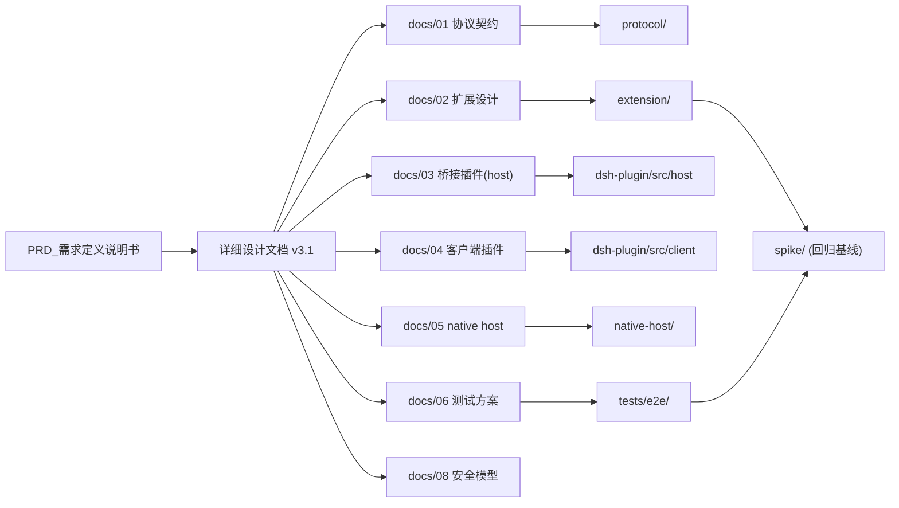

# 文档与代码图谱（DOC-GRAPH）

> **自动生成，请勿手改**：`node scripts/doc-graph.mjs`（校验：`node scripts/doc-graph.mjs --check`）
>
> **更新时机（随项目进展）**：
> 1. 任一 `*.md` 或代码文件增删改后 → `npm run graph:sync`（代码图谱增量重建）+ `npm run graph:docs`（本文件重生成）；
> 2. 每个里程碑（M1–M4）收尾必须执行一次，并把 `--check` 纳入交付前检查；
> 3. `--check` 发现 broken-doc-link / missing-code-ref 时以非零码退出，作为质量门。

## 1. 文档清单（71 份 / 222 个代码与配置文件）

| 文档 | 标题 | 版本 | 行数 | 二级标题数 | 代码引用数 |
|---|---|---|---|---|---|
| `DESIGN.md` | DSH Web Companion — 设计摘要（DESIGN） | v3.1 | 106 | 9 | 0 |
| `FINDINGS.md` | dsh-chrome 可行性验证结果（FINDINGS） | — | 81 | 7 | 0 |
| `PRD_需求定义说明书.md` | DeepSeek Harness Web Companion (DSH 浏览器智能侧伴侣) | v3.0.0 | 138 | 8 | 0 |
| `README.en.md` | DSH Web Companion | — | 6 | 1 | 0 |
| `README.md` | DSH Web Companion | — | 477 | 14 | 3 |
| `docs/01-protocol.md` | 01 · 协议契约（Protocol） | — | 246 | 8 | 8 |
| `docs/02-extension.md` | 02 · Chrome 扩展设计（`extension/`） | — | 296 | 8 | 39 |
| `docs/03-bridge-plugin.md` | 03 · DSH 桥接插件（host 半）设计：`dsh-plugin/` | — | 375 | 10 | 20 |
| `docs/04-client-plugin.md` | 04 · DSH 客户端插件设计（`dsh-plugin/src/client/`） | — | 169 | 8 | 12 |
| `docs/05-native-host.md` | 05 · Native Messaging Host 设计（`native-host/`） | — | 140 | 6 | 9 |
| `docs/06-test-plan.md` | 06 · 测试方案（单测矩阵 + E2E） | — | 128 | 8 | 36 |
| `docs/07-implementation-plan.md` | 07 · 实现计划（任务分解与完成判据） | — | 87 | 7 | 39 |
| `docs/08-security.md` | 08 · 安全与威胁模型 | — | 73 | 6 | 1 |
| `docs/09-manual-checklist.md` | 人工验收清单（有头 Chrome） | — | 58 | 7 | 0 |
| `docs/10-automation.md` | 自动化分层：哪些能无人值守，哪些必须有人（M4-3） | — | 70 | 7 | 0 |
| `docs/11-台账.md` | 项目台账（对照《详细设计文档》） | v3.1 | 245 | 12 | 11 |
| `docs/12-实机验收-测试方案.md` | 实机验收测试方案（v3.38 · 2026-09-12） | — | 188 | 7 | 6 |
| `docs/13-installation.md` | Install & deploy (the bootstrapper) | — | 227 | 17 | 0 |
| `docs/13-安装部署.md` | 安装与部署（引导程序） | — | 221 | 17 | 0 |
| `docs/CHANGELOG.md` | 变更记录（CHANGELOG） | v3.0 | 2752 | 52 | 0 |
| `docs/HANDOFF.md` | 交接提示词（新会话从这里开始） | v3.41，两者**不是同一个号**） | 343 | 10 | 23 |
| `docs/PROGRESS.md` | 进度与续跑规则（durable memory） | — | 97 | 8 | 4 |
| `docs/REVIEW-v3.0.md` | 详细设计 v3.0 评审报告（Review of v3.0 → 修正为 v3.1） | v3.0 | 68 | 5 | 0 |
| `docs/releases/v3.47.0.md` | v3.47.0 — first public release | — | 139 | 10 | 1 |
| `docs/releases/v3.47.1.md` | v3.47.1 — 发布包更干净，说明更好懂 | — | 59 | 6 | 0 |
| `docs/research/01-dsh-plugin-authoring.md` | 01 — Writing, building, installing and testing a THIRD-PARTY DSH plugin (host half + browser/client half) | — | 1137 | 18 | 0 |
| `docs/research/02-dsh-client-composer-attach.md` | 02 — DSH Web GUI 客户端插件「插入 composer 内容 + 附件 + 上下文 chip」seam 调研 | — | 1446 | 22 | 0 |
| `docs/research/03-chrome-extension-constraints.md` | 03 — Chrome (Manifest V3) platform constraints & APIs for the side-panel + local-app extension | — | 591 | 11 | 0 |
| `docs/reviews/manual-acceptance-2026-09-12.md` | 人工验收记录 — 2026-09-12（真机，用户本人操作） | — | 217 | 11 | 0 |
| `docs/reviews/pimoa-adversarial-v3.0.md` | PiMoa 对抗性审核结果 | — | 71 | 4 | 0 |
| `docs/reviews/pimoa-adversarial-v3.1.md` | PiMoa 对抗性审核结果 | — | 93 | 5 | 0 |
| `docs/reviews/pimoa-adversarial-v3.2.md` | PiMoa 对抗性审核结果 | v3.3 | 81 | 5 | 0 |
| `docs/reviews/pimoa-adversarial-v3.3.md` | PiMoa 对抗性审核结果 | — | 73 | 5 | 0 |
| `docs/reviews/pimoa-code-adversarial-2a-extension.md` | PiMoa 对抗性审核结果 | — | 78 | 4 | 0 |
| `docs/reviews/pimoa-code-adversarial-2b-tests.md` | PiMoa 对抗性审核结果 | — | 70 | 4 | 0 |
| `docs/reviews/pimoa-code-adversarial-2c-probes.md` | PiMoa 对抗性审核结果 | — | 66 | 1 | 0 |
| `docs/reviews/pimoa-code-adversarial-bridge.md` | PiMoa 对抗性审核结果 | — | 74 | 5 | 0 |
| `docs/reviews/pimoa-code-adversarial-extension.md` | PiMoa 对抗性审核结果 | — | 14 | 1 | 0 |
| `docs/reviews/pimoa-code-adversarial-index.md` | PiMoa 对抗性审查 — 驱动索引与转述（非 PiMoa 原始裁决） | — | 168 | 9 | 0 |
| `docs/reviews/pimoa-code-review-1-bridge.md` | PiMoa 对抗性审核结果 | — | 67 | 4 | 0 |
| `docs/reviews/pimoa-code-review-2-extension.md` | PiMoa 对抗性审核结果 | — | 63 | 1 | 0 |
| `docs/reviews/pimoa-code-review-3-tests.md` | PiMoa 对抗性审核结果 | — | 52 | 4 | 0 |
| `docs/reviews/pimoa-code-review-4a-probes-m0m1.md` | PiMoa 对抗性审核结果 | — | 90 | 4 | 0 |
| `docs/reviews/pimoa-code-review-4c-probes-m2.md` | PiMoa 对抗性审核结果 | — | 55 | 5 | 0 |
| `docs/reviews/pimoa-code-review-4d-probes-m3.md` | PiMoa 对抗性审核结果 | — | 52 | 4 | 0 |
| `docs/reviews/pimoa-verification-2026-09-12.md` | PiMoa 审核结论·独立验真（2026-09-12） | — | 115 | 10 | 0 |
| `docs/reviews/pimoa-wizard-1-orchestration.md` | PiMoa 对抗性审核结果 | — | 60 | 4 | 0 |
| `docs/reviews/pimoa-wizard-2-wiring.md` | PiMoa 对抗性审核结果 | — | 69 | 5 | 0 |
| `docs/reviews/pimoa-wizard-3-interaction.md` | PiMoa 对抗性审核结果 | — | 67 | 5 | 0 |
| `docs/reviews/pimoa-wizard-4a-judgement.md` | PiMoa 对抗性审核结果 | — | 70 | 5 | 0 |
| `docs/reviews/pimoa-wizard-4b-orchestration.md` | PiMoa 对抗性审核结果 | — | 64 | 5 | 0 |
| `docs/reviews/pimoa-wizard-4c-data-safety.md` | PiMoa 对抗性审核结果 | — | 62 | 5 | 0 |
| `docs/reviews/pimoa-wizard-5-tests.md` | PiMoa 对抗性审核结果 | — | 57 | 4 | 0 |
| `docs/reviews/pimoa-wizard-6a-judgement.md` | PiMoa 对抗性审核结果 | — | 64 | 5 | 0 |
| `docs/reviews/pimoa-wizard-6b-orchestration.md` | PiMoa 对抗性审核结果 | — | 61 | 4 | 0 |
| `docs/reviews/probe-autostart-manual-verification.md` | M2 · 自动拉起（H4①）实测验证 —— 用户真实 Chrome | — | 26 | 4 | 0 |
| `docs/reviews/probe-chip.md` | M0b 探针报告 · E2E-0 完整闭环（probe-chip） | — | 42 | 6 | 0 |
| `docs/reviews/probe-composer.md` | M0a 探针报告 · composer / client 插件契约（probe-composer） | — | 46 | 3 | 0 |
| `docs/reviews/probe-cookie-matrix.md` | M0a 探针报告 · Cookie 矩阵（probe-cookie-matrix） | — | 49 | 5 | 0 |
| `docs/reviews/probe-keepalive.md` | M0a 探针报告 · 空闲 WebSocket 保活（probe-keepalive / Q8） | — | 29 | 4 | 0 |
| `docs/reviews/probe-permission.md` | M0a 探针报告 · 权限实验（probe-permission） | — | 35 | 5 | 0 |
| `scripts/review-prompts/code-adversarial.md` | Prompt：对抗性代码审查（假定"已修好/已验证"都是假的） | — | 42 | 6 | 5 |
| `scripts/review-prompts/code-review.md` | Prompt：全量代码审查（接线 / 假绿 / 硬编码优先） | — | 52 | 4 | 2 |
| `scripts/review-prompts/design-adversarial.md` | scripts/review-prompts/design-adversarial.md | — | 27 | 4 | 0 |
| `scripts/review-prompts/wizard-1-orchestration.md` | Prompt：安装/升级向导（片 1／共 3）—— 编排、幂等、假 dry-run、失败语义 | — | 76 | 5 | 4 |
| `scripts/review-prompts/wizard-2-wiring.md` | Prompt：安装/升级向导（片 2／共 3）—— 环境探测、路径规划与"接线" | — | 82 | 5 | 14 |
| `scripts/review-prompts/wizard-3-interaction.md` | Prompt：安装/升级向导（片 3／共 3）—— 交互、预检与"健康判定"（假绿重灾区） | — | 66 | 4 | 5 |
| `scripts/review-prompts/wizard-4-changes.md` | Prompt：审查**刚做完的这批改动**（引导程序修复 + 依赖兜底） | — | 52 | 4 | 1 |
| `scripts/review-prompts/wizard-5-tests.md` | Prompt：审查**刚补的一批测试改动**（行为测试 + 修无效断言 + 去硬编码） | — | 54 | 4 | 5 |
| `scripts/review-prompts/wizard-6-frozen.md` | Prompt：审查**冻结版**引导程序的「未被审过的那一段改动」 | — | 49 | 4 | 1 |
| `详细设计文档.md` | DSH Web Companion · 详细设计规范说明书 | v3.37 | 930 | 16 | 44 |

## 2. 文档 ↔ 代码 覆盖矩阵

| 代码区 | 职责 | 描述它的文档 |
|---|---|---|
| `extension/` | Chrome MV3 扩展（side panel / service worker / content script） | `docs/01-protocol.md` `docs/06-test-plan.md` `docs/HANDOFF.md` `scripts/review-prompts/wizard-4-changes.md` `详细设计文档.md` |
| `dsh-plugin/` | DSH 进程内插件（host 桥接 + client composer 注入） | `docs/01-protocol.md` `docs/HANDOFF.md` `scripts/review-prompts/code-adversarial.md` `详细设计文档.md` |
| `native-host/` | native messaging 宿主（拉起 dsh web，M2） | `docs/01-protocol.md` `docs/HANDOFF.md` |
| `protocol/` | 单源消息 schema + codegen | `docs/01-protocol.md` `docs/06-test-plan.md` `详细设计文档.md` |
| `scripts/` | 安装 / 配对 / 工具脚本 | `docs/05-native-host.md` `docs/06-test-plan.md` `docs/07-implementation-plan.md` `docs/11-台账.md` `docs/HANDOFF.md` `scripts/review-prompts/code-adversarial.md` `scripts/review-prompts/code-review.md` `scripts/review-prompts/design-adversarial.md` `scripts/review-prompts/wizard-1-orchestration.md` `scripts/review-prompts/wizard-2-wiring.md` `scripts/review-prompts/wizard-3-interaction.md` `scripts/review-prompts/wizard-4-changes.md` `scripts/review-prompts/wizard-5-tests.md` `scripts/review-prompts/wizard-6-frozen.md` `详细设计文档.md` |
| `tests/e2e/` | E2E harness 与用例 | `docs/06-test-plan.md` |
| `spike/` | 可行性实验（回归基线） | `docs/06-test-plan.md` `详细设计文档.md` |

## 3. 代码区依赖图（文档层视角）

## 4. 规划中但尚未实现的引用（实现进度视角）

> 这些引用指向"设计已定、代码未写"的路径，随 M1–M4 推进应逐步从本表消失。

| 引用路径 | 出现在文档 |
|---|---|
| `dsh-plugin/src/shared/protocol.generated.ts` | `docs/01-protocol.md` |
| `extension/src/content/markdown.js` | `docs/06-test-plan.md` |
| `extension/src/lib/cookie.js` | `docs/06-test-plan.md` |
| `extension/src/sw/agent-bridge.js` | `docs/06-test-plan.md` |
| `extension/tests/unit/markdown.test.js` | `docs/06-test-plan.md` |
| `protocol/tests/sync.test.mjs` | `docs/06-test-plan.md` |
| `scripts/setup.mjs` | `docs/07-implementation-plan.md` |
| `spike/out/embed-report.json` | `docs/06-test-plan.md` |
| `tests/e2e/out/report.json` | `docs/06-test-plan.md` |

### 4.2 松散引用（设计草图里的文件名，尚未落位）

| 引用路径 | 出现在文档 |
|---|---|
| `.../agent-bridge.test.js` | `docs/06-test-plan.md` |
| `.../attach-sender.test.js` | `docs/06-test-plan.md` |
| `.../capture.test.js` | `docs/06-test-plan.md` |
| `.../cookie.test.js` | `docs/06-test-plan.md` |
| `.../dsh-session.test.js` | `docs/06-test-plan.md` |
| `.../extract.test.js` | `docs/06-test-plan.md` |
| `.../hub.test.ts` | `docs/06-test-plan.md` |
| `.../m3-agent-turn-probe.json` | `docs/11-台账.md` |
| `.../m3-control-probe.json` | `docs/11-台账.md` |
| `.../m3-debugger-probe.json` | `docs/11-台账.md` |
| `.../native-host.test.js` | `docs/06-test-plan.md` |
| `.../state.test.js` | `docs/06-test-plan.md` |
| `.../store.test.ts` | `docs/06-test-plan.md` |
| `.../tool-bridge.test.ts` | `docs/06-test-plan.md` |
| `E2E/cases/e2e1-embed.mjs` | `docs/07-implementation-plan.md` |
| `E2E/cases/e2e10-regression-baseline.mjs` | `docs/07-implementation-plan.md` |
| `EXT/manifest.json` | `docs/07-implementation-plan.md` |
| `EXT/src/content/content.js` | `docs/07-implementation-plan.md` |
| `EXT/src/content/extract.fn.js` | `docs/07-implementation-plan.md` |
| `EXT/src/sidepanel/iframe-host.js` | `docs/07-implementation-plan.md` |
| `EXT/src/sidepanel/toolbar.js` | `docs/07-implementation-plan.md` |
| `EXT/src/sw/agent-bridge.js` | `docs/07-implementation-plan.md` |
| `EXT/src/sw/attach-sender.js` | `docs/07-implementation-plan.md` |
| `EXT/src/sw/capture.js` | `docs/07-implementation-plan.md` |
| `EXT/src/sw/commands.js` | `docs/07-implementation-plan.md` |
| `EXT/src/sw/dsh-session.js` | `docs/07-implementation-plan.md` |
| `EXT/src/sw/index.js` | `docs/07-implementation-plan.md` |
| `EXT/src/sw/panel-control.js` | `docs/07-implementation-plan.md` |
| `NH/install.mjs` | `docs/07-implementation-plan.md` |
| `PLUG/build.mjs` | `docs/07-implementation-plan.md` |
| `PLUG/package.json` | `docs/07-implementation-plan.md` |
| `PLUG/src/host/cookie.ts` | `docs/07-implementation-plan.md` |
| `PLUG/src/host/hub.ts` | `docs/07-implementation-plan.md` |
| `PLUG/src/host/routes/attach.ts` | `docs/07-implementation-plan.md` |
| `PLUG/src/host/tool-bridge.ts` | `docs/07-implementation-plan.md` |
| `PLUG/tests/host/cookie.vector.test.ts` | `docs/07-implementation-plan.md` |
| `PROTO/codegen.mjs` | `docs/07-implementation-plan.md` |
| `PROTO/messages.schema.json` | `docs/07-implementation-plan.md` |
| `ack.ts` | `docs/03-bridge-plugin.md` |
| `agent-bridge.test.js` | `docs/02-extension.md` `docs/07-implementation-plan.md` |
| `attach-sender.test.js` | `docs/02-extension.md` |
| `attach-store.test.ts` | `docs/04-client-plugin.md` |
| `attach.ts` | `docs/03-bridge-plugin.md` |
| `background/service-worker.ts` | `详细设计文档.md` |
| `bootstrap.install.mjs` | `README.md` |
| `bridge-client.test.ts` | `docs/04-client-plugin.md` |
| `capture.test.js` | `docs/02-extension.md` |
| `chip.test.tsx` | `docs/04-client-plugin.md` |
| `chip.tsx` | `docs/04-client-plugin.md` |
| `click.js` | `docs/02-extension.md` |
| `composer-insert.test.ts` | `docs/04-client-plugin.md` |
| `composer-insert.ts` | `docs/04-client-plugin.md` |
| `config.test.ts` | `docs/03-bridge-plugin.md` |
| `content.js` | `docs/02-extension.md` |
| `content/markdown.js` | `docs/02-extension.md` |
| `contract/slots.d.ts` | `docs/04-client-plugin.md` `详细设计文档.md` |
| `cookie.test.js` | `docs/02-extension.md` |
| `cookie.ts` | `docs/03-bridge-plugin.md` |
| `cookie.vector.test.ts` | `docs/03-bridge-plugin.md` |
| `docs/reviews/probe-seed.json` | `详细设计文档.md` |
| `enter.ts` | `docs/03-bridge-plugin.md` `docs/11-台账.md` |
| `extract.test.js` | `docs/02-extension.md` `docs/07-implementation-plan.md` |
| `extractor.ts` | `详细设计文档.md` |
| `framing.test.mjs` | `docs/05-native-host.md` |
| `guard.test.ts` | `docs/03-bridge-plugin.md` |
| `hub.test.ts` | `docs/03-bridge-plugin.md` `docs/07-implementation-plan.md` |
| `hub.ts` | `docs/03-bridge-plugin.md` `docs/11-台账.md` |
| `iframe-host.js` | `docs/02-extension.md` |
| `install.test.mjs` | `docs/05-native-host.md` |
| `intent-sniff.ts` | `详细设计文档.md` |
| `launcher.test.mjs` | `docs/05-native-host.md` |
| `lib/cookie.js` | `docs/02-extension.md` |
| `log.ts` | `docs/08-security.md` |
| `markdown.js` | `docs/02-extension.md` `docs/06-test-plan.md` `docs/07-implementation-plan.md` |
| `markdown.test.js` | `docs/02-extension.md` `docs/07-implementation-plan.md` |
| `media.ts` | `详细设计文档.md` |
| `native-host.test.js` | `docs/02-extension.md` |
| `navigate.js` | `docs/02-extension.md` |
| `ops-click.test.js` | `docs/02-extension.md` |
| `ops/screenshot.js` | `docs/07-implementation-plan.md` |
| `out/e2e1.json` | `docs/06-test-plan.md` |
| `out/e2e3.json` | `docs/06-test-plan.md` |
| `out/e2e4.json` | `docs/06-test-plan.md` |
| `out/e2e6.json` | `docs/06-test-plan.md` |
| `out/e2e8.json` | `docs/06-test-plan.md` |
| `out/e2e9.json` | `docs/06-test-plan.md` |
| `panel.ts` | `详细设计文档.md` |
| `pending.ts` | `docs/03-bridge-plugin.md` |
| `protocol-sync.test.js` | `docs/02-extension.md` |
| `protocol-sync.test.ts` | `docs/03-bridge-plugin.md` `docs/04-client-plugin.md` |
| `read.js` | `docs/02-extension.md` |
| `routes.attach.test.ts` | `docs/03-bridge-plugin.md` `docs/07-implementation-plan.md` |
| `routes.enter.test.ts` | `docs/03-bridge-plugin.md` |
| `routes/enter.ts` | `docs/07-implementation-plan.md` |
| `routes/ping.ts` | `docs/07-implementation-plan.md` |
| `run.sh` | `docs/05-native-host.md` |
| `runtime-config.json` | `docs/05-native-host.md` |
| `screenshot.js` | `docs/02-extension.md` |
| `selection.ts` | `详细设计文档.md` |
| `settings.js` | `docs/07-implementation-plan.md` |
| `slots.d.ts` | `docs/04-client-plugin.md` |
| `src/sw/agent-bridge.js` | `docs/02-extension.md` |
| `src/sw/panel-control.js` | `docs/02-extension.md` |
| `state.test.js` | `docs/02-extension.md` |
| `store.test.ts` | `docs/03-bridge-plugin.md` `docs/07-implementation-plan.md` |
| `store.ts` | `docs/03-bridge-plugin.md` `docs/07-implementation-plan.md` |
| `tabs.js` | `docs/02-extension.md` |
| `tests/fakes/chrome.js` | `docs/02-extension.md` |
| `tests/host/cookie.vector.test.ts` | `docs/03-bridge-plugin.md` |
| `tests/host/integration.test.ts` | `docs/03-bridge-plugin.md` |
| `tool-bridge.test.ts` | `docs/03-bridge-plugin.md` `docs/07-implementation-plan.md` |
| `toolbar.js` | `docs/02-extension.md` |
| `type.js` | `docs/02-extension.md` |
| `wait.js` | `docs/02-extension.md` |

### 4.3 外部引用（DSH 安装包 / 系统路径，非本仓库文件）

| 引用路径 | 出现在文档 |
|---|---|
| `/Users/mac/.dsh/dsh-web-companion.json` | `docs/11-台账.md` `docs/HANDOFF.md` |
| `@deepseek-ai/dsh-client-ui-conversation/lib/types/client/contract/input.d.ts` | `docs/04-client-plugin.md` |
| `dsh-client-ui-renderer/lib/client.js` | `详细设计文档.md` |
| `dsh-session.test.js` | `docs/02-extension.md` |

## 5. 图谱问题（必须为零）

| 类型 | 文档 | 引用 |
|---|---|---|
（无）
