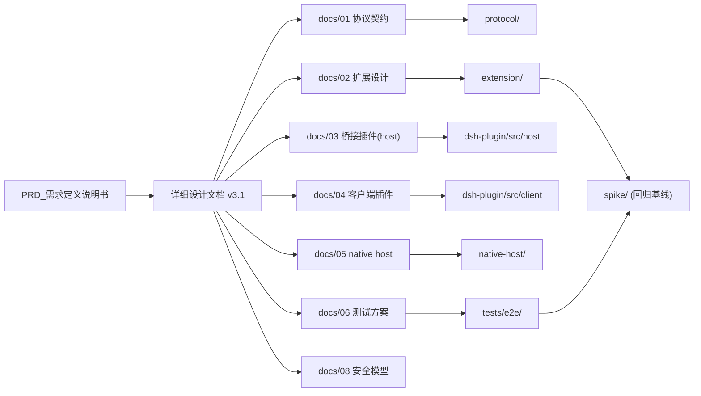

# 文档与代码图谱（DOC-GRAPH）

> **自动生成，请勿手改**：`node scripts/doc-graph.mjs`（校验：`node scripts/doc-graph.mjs --check`）
> 生成时间：2026-09-11T19:54:28.275Z
>
> **更新时机（随项目进展）**：
> 1. 任一 `*.md` 或代码文件增删改后 → `npm run graph:sync`（代码图谱增量重建）+ `npm run graph:docs`（本文件重生成）；
> 2. 每个里程碑（M1–M4）收尾必须执行一次，并把 `--check` 纳入交付前检查；
> 3. `--check` 发现 broken-doc-link / missing-code-ref 时以非零码退出，作为质量门。

## 1. 文档清单（29 份 / 103 个代码与配置文件）

| 文档 | 标题 | 版本 | 行数 | 二级标题数 | 代码引用数 |
|---|---|---|---|---|---|
| `DESIGN.md` | DSH Web Companion — 设计摘要（DESIGN） | v3.1 | 106 | 9 | 0 |
| `FINDINGS.md` | dsh-chrome 可行性验证结果（FINDINGS） | — | 81 | 7 | 0 |
| `PRD_需求定义说明书.md` | DeepSeek Harness Web Companion (DSH 浏览器智能侧伴侣) | v3.0.0 | 138 | 8 | 0 |
| `README.md` | DSH Web Companion（DeepSeek Harness 网页侧边栏智能伴侣） | — | 81 | 7 | 0 |
| `docs/01-protocol.md` | 01 · 协议契约（Protocol） | — | 229 | 8 | 6 |
| `docs/02-extension.md` | 02 · Chrome 扩展设计（`extension/`） | — | 295 | 8 | 39 |
| `docs/03-bridge-plugin.md` | 03 · DSH 桥接插件（host 半）设计：`dsh-plugin/` | — | 332 | 9 | 20 |
| `docs/04-client-plugin.md` | 04 · DSH 客户端插件设计（`dsh-plugin/src/client/`） | — | 169 | 8 | 12 |
| `docs/05-native-host.md` | 05 · Native Messaging Host 设计（`native-host/`） | — | 140 | 6 | 9 |
| `docs/06-test-plan.md` | 06 · 测试方案（单测矩阵 + E2E） | — | 128 | 8 | 36 |
| `docs/07-implementation-plan.md` | 07 · 实现计划（任务分解与完成判据） | — | 87 | 7 | 39 |
| `docs/08-security.md` | 08 · 安全与威胁模型 | — | 73 | 6 | 1 |
| `docs/CHANGELOG.md` | 变更记录（CHANGELOG） | v3.0 | 385 | 16 | 0 |
| `docs/DOC-GRAPH.md` | 文档与代码图谱（DOC-GRAPH） | — | 305 | 6 | 204 |
| `docs/REVIEW-v3.0.md` | 详细设计 v3.0 评审报告（Review of v3.0 → 修正为 v3.1） | v3.0 | 68 | 5 | 0 |
| `docs/research/01-dsh-plugin-authoring.md` | 01 — Writing, building, installing and testing a THIRD-PARTY DSH plugin (host half + browser/client half) | — | 1137 | 18 | 0 |
| `docs/research/02-dsh-client-composer-attach.md` | 02 — DSH Web GUI 客户端插件「插入 composer 内容 + 附件 + 上下文 chip」seam 调研 | — | 1446 | 22 | 0 |
| `docs/research/03-chrome-extension-constraints.md` | 03 — Chrome (Manifest V3) platform constraints & APIs for the side-panel + local-app extension | — | 591 | 11 | 0 |
| `docs/reviews/pimoa-adversarial-v3.0.md` | PiMoa 对抗性审核结果 | — | 71 | 4 | 0 |
| `docs/reviews/pimoa-adversarial-v3.1.md` | PiMoa 对抗性审核结果 | — | 93 | 5 | 0 |
| `docs/reviews/pimoa-adversarial-v3.2.md` | PiMoa 对抗性审核结果 | v3.3 | 81 | 5 | 0 |
| `docs/reviews/pimoa-adversarial-v3.3.md` | PiMoa 对抗性审核结果 | — | 73 | 5 | 0 |
| `docs/reviews/probe-chip.md` | M0b 探针报告 · E2E-0 完整闭环（probe-chip） | — | 42 | 6 | 0 |
| `docs/reviews/probe-composer.md` | M0a 探针报告 · composer / client 插件契约（probe-composer） | — | 46 | 3 | 0 |
| `docs/reviews/probe-cookie-matrix.md` | M0a 探针报告 · Cookie 矩阵（probe-cookie-matrix） | — | 49 | 5 | 0 |
| `docs/reviews/probe-keepalive.md` | M0a 探针报告 · 空闲 WebSocket 保活（probe-keepalive / Q8） | — | 29 | 4 | 0 |
| `docs/reviews/probe-permission.md` | M0a 探针报告 · 权限实验（probe-permission） | — | 35 | 5 | 0 |
| `scripts/review-prompts/design-adversarial.md` | scripts/review-prompts/design-adversarial.md | — | 27 | 4 | 0 |
| `详细设计文档.md` | DSH Web Companion · 详细设计规范说明书 | v3.13 | 814 | 16 | 22 |

## 2. 文档 ↔ 代码 覆盖矩阵

| 代码区 | 职责 | 描述它的文档 |
|---|---|---|
| `extension/` | Chrome MV3 扩展（side panel / service worker / content script） | `docs/01-protocol.md` `docs/06-test-plan.md` `docs/DOC-GRAPH.md` `详细设计文档.md` |
| `dsh-plugin/` | DSH 进程内插件（host 桥接 + client composer 注入） | `docs/01-protocol.md` `docs/DOC-GRAPH.md` `详细设计文档.md` |
| `native-host/` | native messaging 宿主（拉起 dsh web，M2） | `docs/01-protocol.md` |
| `protocol/` | 单源消息 schema + codegen | `docs/01-protocol.md` `docs/06-test-plan.md` `docs/DOC-GRAPH.md` `详细设计文档.md` |
| `scripts/` | 安装 / 配对 / 工具脚本 | `docs/05-native-host.md` `docs/06-test-plan.md` `docs/07-implementation-plan.md` `docs/DOC-GRAPH.md` `scripts/review-prompts/design-adversarial.md` `详细设计文档.md` |
| `tests/e2e/` | E2E harness 与用例 | `docs/06-test-plan.md` `docs/DOC-GRAPH.md` |
| `spike/` | 可行性实验（回归基线） | `docs/06-test-plan.md` `docs/DOC-GRAPH.md` `详细设计文档.md` |

## 3. 代码区依赖图（文档层视角）

## 4. 规划中但尚未实现的引用（实现进度视角）

> 这些引用指向"设计已定、代码未写"的路径，随 M1–M4 推进应逐步从本表消失。

| 引用路径 | 出现在文档 |
|---|---|
| `dsh-plugin/src/shared/protocol.generated.ts` | `docs/01-protocol.md` `docs/DOC-GRAPH.md` |
| `extension/src/content/extract.fn.js` | `docs/06-test-plan.md` `docs/DOC-GRAPH.md` |
| `extension/src/content/markdown.js` | `docs/06-test-plan.md` `docs/DOC-GRAPH.md` |
| `extension/src/lib/cookie.js` | `docs/06-test-plan.md` `docs/DOC-GRAPH.md` |
| `extension/src/sw/agent-bridge.js` | `docs/06-test-plan.md` `docs/DOC-GRAPH.md` |
| `extension/src/sw/attach-sender.js` | `docs/06-test-plan.md` `docs/DOC-GRAPH.md` |
| `extension/src/sw/capture.js` | `docs/06-test-plan.md` `docs/DOC-GRAPH.md` |
| `extension/src/sw/native-host.js` | `docs/06-test-plan.md` `docs/DOC-GRAPH.md` |
| `extension/tests/unit/markdown.test.js` | `docs/06-test-plan.md` `docs/DOC-GRAPH.md` |
| `protocol/tests/sync.test.mjs` | `docs/06-test-plan.md` `docs/DOC-GRAPH.md` |
| `scripts/install-plugin.mjs` | `docs/DOC-GRAPH.md` |
| `scripts/setup.mjs` | `docs/07-implementation-plan.md` `docs/DOC-GRAPH.md` |
| `spike/out/embed-report.json` | `docs/06-test-plan.md` `docs/DOC-GRAPH.md` |
| `tests/e2e/out/report.json` | `docs/06-test-plan.md` `docs/DOC-GRAPH.md` |

### 4.2 松散引用（设计草图里的文件名，尚未落位）

| 引用路径 | 出现在文档 |
|---|---|
| `.../agent-bridge.test.js` | `docs/06-test-plan.md` `docs/DOC-GRAPH.md` |
| `.../apps/web/package.json` | `docs/DOC-GRAPH.md` |
| `.../apps/web/tests/scaffold.ts` | `docs/DOC-GRAPH.md` |
| `.../apps/web/tests/support.ts` | `docs/DOC-GRAPH.md` |
| `.../apps/web/vite.config.ts` | `docs/DOC-GRAPH.md` |
| `.../attach-sender.test.js` | `docs/06-test-plan.md` `docs/DOC-GRAPH.md` |
| `.../capture.test.js` | `docs/06-test-plan.md` `docs/DOC-GRAPH.md` |
| `.../cookie.test.js` | `docs/06-test-plan.md` `docs/DOC-GRAPH.md` |
| `.../dsh-session.test.js` | `docs/06-test-plan.md` `docs/DOC-GRAPH.md` |
| `.../extract.test.js` | `docs/06-test-plan.md` `docs/DOC-GRAPH.md` |
| `.../hub.test.ts` | `docs/06-test-plan.md` `docs/DOC-GRAPH.md` |
| `.../native-host.test.js` | `docs/06-test-plan.md` `docs/DOC-GRAPH.md` |
| `.../package.json` | `docs/DOC-GRAPH.md` |
| `.../packages/client/tsdown.client.ts` | `docs/DOC-GRAPH.md` |
| `.../packages/client/web/src/platform.ts` | `docs/DOC-GRAPH.md` |
| `.../packages/client/web/src/seed.ts` | `docs/DOC-GRAPH.md` |
| `.../state.test.js` | `docs/06-test-plan.md` `docs/DOC-GRAPH.md` |
| `.../store.test.ts` | `docs/06-test-plan.md` `docs/DOC-GRAPH.md` |
| `.../tool-bridge.test.ts` | `docs/06-test-plan.md` `docs/DOC-GRAPH.md` |
| `.../tsdown.config.ts` | `docs/DOC-GRAPH.md` |
| `.../vitest.config.ts` | `docs/DOC-GRAPH.md` |
| `../../scripts/client-build-environment.ts` | `docs/DOC-GRAPH.md` |
| `./package.json` | `docs/DOC-GRAPH.md` |
| `.d.ts` | `docs/DOC-GRAPH.md` |
| `.e2e.ts` | `docs/DOC-GRAPH.md` |
| `.expected.e2e.ts` | `docs/DOC-GRAPH.md` |
| `.perf.ts` | `docs/DOC-GRAPH.md` |
| `.snapshot.ts` | `docs/DOC-GRAPH.md` |
| `.spec.ts` | `docs/DOC-GRAPH.md` |
| `E2E/cases/e2e1-embed.mjs` | `docs/07-implementation-plan.md` `docs/DOC-GRAPH.md` |
| `E2E/cases/e2e10-regression-baseline.mjs` | `docs/07-implementation-plan.md` `docs/DOC-GRAPH.md` |
| `EXT/manifest.json` | `docs/07-implementation-plan.md` `docs/DOC-GRAPH.md` |
| `EXT/src/content/content.js` | `docs/07-implementation-plan.md` `docs/DOC-GRAPH.md` |
| `EXT/src/content/extract.fn.js` | `docs/07-implementation-plan.md` `docs/DOC-GRAPH.md` |
| `EXT/src/sidepanel/iframe-host.js` | `docs/07-implementation-plan.md` `docs/DOC-GRAPH.md` |
| `EXT/src/sidepanel/toolbar.js` | `docs/07-implementation-plan.md` `docs/DOC-GRAPH.md` |
| `EXT/src/sw/agent-bridge.js` | `docs/07-implementation-plan.md` `docs/DOC-GRAPH.md` |
| `EXT/src/sw/attach-sender.js` | `docs/07-implementation-plan.md` `docs/DOC-GRAPH.md` |
| `EXT/src/sw/capture.js` | `docs/07-implementation-plan.md` `docs/DOC-GRAPH.md` |
| `EXT/src/sw/commands.js` | `docs/07-implementation-plan.md` `docs/DOC-GRAPH.md` |
| `EXT/src/sw/dsh-session.js` | `docs/07-implementation-plan.md` `docs/DOC-GRAPH.md` |
| `EXT/src/sw/index.js` | `docs/07-implementation-plan.md` `docs/DOC-GRAPH.md` |
| `EXT/src/sw/panel-control.js` | `docs/07-implementation-plan.md` `docs/DOC-GRAPH.md` |
| `NH/install.mjs` | `docs/07-implementation-plan.md` `docs/DOC-GRAPH.md` |
| `PLUG/build.mjs` | `docs/07-implementation-plan.md` `docs/DOC-GRAPH.md` |
| `PLUG/package.json` | `docs/07-implementation-plan.md` `docs/DOC-GRAPH.md` |
| `PLUG/src/host/cookie.ts` | `docs/07-implementation-plan.md` `docs/DOC-GRAPH.md` |
| `PLUG/src/host/hub.ts` | `docs/07-implementation-plan.md` `docs/DOC-GRAPH.md` |
| `PLUG/src/host/routes/attach.ts` | `docs/07-implementation-plan.md` `docs/DOC-GRAPH.md` |
| `PLUG/src/host/tool-bridge.ts` | `docs/07-implementation-plan.md` `docs/DOC-GRAPH.md` |
| `PLUG/tests/host/cookie.vector.test.ts` | `docs/07-implementation-plan.md` `docs/DOC-GRAPH.md` |
| `PROTO/codegen.mjs` | `docs/07-implementation-plan.md` `docs/DOC-GRAPH.md` |
| `PROTO/messages.schema.json` | `docs/07-implementation-plan.md` `docs/DOC-GRAPH.md` |
| `ack.ts` | `docs/03-bridge-plugin.md` `docs/DOC-GRAPH.md` |
| `agent-bridge.test.js` | `docs/02-extension.md` `docs/07-implementation-plan.md` `docs/DOC-GRAPH.md` |
| `antigravity-companion.json` | `docs/DOC-GRAPH.md` |
| `apps/web/tests/scaffold.ts` | `docs/DOC-GRAPH.md` |
| `apps/web/vite.config.ts` | `docs/DOC-GRAPH.md` |
| `attach-sender.test.js` | `docs/02-extension.md` `docs/DOC-GRAPH.md` |
| `attach-store.test.ts` | `docs/04-client-plugin.md` `docs/DOC-GRAPH.md` |
| `attach.ts` | `docs/03-bridge-plugin.md` `docs/DOC-GRAPH.md` |
| `background/service-worker.ts` | `docs/DOC-GRAPH.md` `详细设计文档.md` |
| `bridge-client.test.ts` | `docs/04-client-plugin.md` `docs/DOC-GRAPH.md` |
| `build.mjs` | `docs/02-extension.md` `docs/DOC-GRAPH.md` |
| `capture.js` | `docs/07-implementation-plan.md` `docs/DOC-GRAPH.md` |
| `capture.test.js` | `docs/02-extension.md` `docs/DOC-GRAPH.md` |
| `chip.test.tsx` | `docs/04-client-plugin.md` `docs/DOC-GRAPH.md` |
| `chip.tsx` | `docs/04-client-plugin.md` `docs/DOC-GRAPH.md` |
| `click.js` | `docs/02-extension.md` `docs/DOC-GRAPH.md` |
| `composer-insert.test.ts` | `docs/04-client-plugin.md` `docs/DOC-GRAPH.md` |
| `composer-insert.ts` | `docs/04-client-plugin.md` `docs/DOC-GRAPH.md` |
| `config.test.ts` | `docs/03-bridge-plugin.md` `docs/DOC-GRAPH.md` |
| `content.js` | `docs/02-extension.md` `docs/DOC-GRAPH.md` |
| `content/intent-sniff.ts` | `docs/DOC-GRAPH.md` |
| `content/markdown.js` | `docs/02-extension.md` `docs/DOC-GRAPH.md` |
| `contract/slots.d.ts` | `docs/04-client-plugin.md` `docs/DOC-GRAPH.md` `详细设计文档.md` |
| `cookie.test.js` | `docs/02-extension.md` `docs/DOC-GRAPH.md` |
| `cookie.ts` | `docs/03-bridge-plugin.md` `docs/DOC-GRAPH.md` |
| `cookie.vector.test.ts` | `docs/03-bridge-plugin.md` `docs/DOC-GRAPH.md` |
| `deepseek-harness/packages/client/ui-conversation/src/client/input/contract.ts` | `docs/DOC-GRAPH.md` |
| `docs/reviews/probe-seed.json` | `docs/DOC-GRAPH.md` `详细设计文档.md` |
| `enter.ts` | `docs/03-bridge-plugin.md` `docs/DOC-GRAPH.md` |
| `extract.fn.js` | `docs/02-extension.md` `docs/DOC-GRAPH.md` |
| `extract.test.js` | `docs/02-extension.md` `docs/07-implementation-plan.md` `docs/DOC-GRAPH.md` |
| `extractor.ts` | `docs/DOC-GRAPH.md` `详细设计文档.md` |
| `facade.d.ts` | `docs/DOC-GRAPH.md` |
| `facade.ts` | `docs/DOC-GRAPH.md` |
| `framing.test.mjs` | `docs/05-native-host.md` `docs/DOC-GRAPH.md` |
| `guard.test.ts` | `docs/03-bridge-plugin.md` `docs/DOC-GRAPH.md` |
| `hub.d.ts` | `docs/DOC-GRAPH.md` |
| `hub.test.ts` | `docs/03-bridge-plugin.md` `docs/07-implementation-plan.md` `docs/DOC-GRAPH.md` |
| `hub.ts` | `docs/03-bridge-plugin.md` `docs/DOC-GRAPH.md` |
| `iframe-host.js` | `docs/02-extension.md` `docs/DOC-GRAPH.md` |
| `index.d.ts` | `docs/DOC-GRAPH.md` |
| `install.mjs` | `docs/05-native-host.md` `docs/DOC-GRAPH.md` |
| `install.test.mjs` | `docs/05-native-host.md` `docs/DOC-GRAPH.md` |
| `intent-sniff.ts` | `docs/DOC-GRAPH.md` `详细设计文档.md` |
| `launcher.mjs` | `docs/05-native-host.md` `docs/DOC-GRAPH.md` |
| `launcher.test.mjs` | `docs/05-native-host.md` `docs/DOC-GRAPH.md` |
| `lib/cookie.js` | `docs/02-extension.md` `docs/DOC-GRAPH.md` |
| `lib/index.js` | `docs/DOC-GRAPH.md` |
| `lib/types/client/index.js` | `docs/DOC-GRAPH.md` |
| `lib/types/invariant.js` | `docs/DOC-GRAPH.md` |
| `log.ts` | `docs/08-security.md` `docs/DOC-GRAPH.md` |
| `markdown.js` | `docs/02-extension.md` `docs/06-test-plan.md` `docs/07-implementation-plan.md` `docs/DOC-GRAPH.md` |
| `markdown.test.js` | `docs/02-extension.md` `docs/07-implementation-plan.md` `docs/DOC-GRAPH.md` |
| `media.ts` | `docs/DOC-GRAPH.md` `详细设计文档.md` |
| `native-host.js` | `docs/02-extension.md` `docs/DOC-GRAPH.md` |
| `native-host.test.js` | `docs/02-extension.md` `docs/DOC-GRAPH.md` |
| `navigate.js` | `docs/02-extension.md` `docs/DOC-GRAPH.md` |
| `ops-click.test.js` | `docs/02-extension.md` `docs/DOC-GRAPH.md` |
| `ops/screenshot.js` | `docs/07-implementation-plan.md` `docs/DOC-GRAPH.md` |
| `out/e2e1.json` | `docs/06-test-plan.md` `docs/DOC-GRAPH.md` |
| `out/e2e3.json` | `docs/06-test-plan.md` `docs/DOC-GRAPH.md` |
| `out/e2e4.json` | `docs/06-test-plan.md` `docs/DOC-GRAPH.md` |
| `out/e2e6.json` | `docs/06-test-plan.md` `docs/DOC-GRAPH.md` |
| `out/e2e8.json` | `docs/06-test-plan.md` `docs/DOC-GRAPH.md` |
| `out/e2e9.json` | `docs/06-test-plan.md` `docs/DOC-GRAPH.md` |
| `packages/client/tsdown.client.ts` | `docs/DOC-GRAPH.md` |
| `packages/client/ui-goal/tsdown.config.ts` | `docs/DOC-GRAPH.md` |
| `packages/client/ui-slots/package.json` | `docs/DOC-GRAPH.md` |
| `packages/client/web/src/seed.ts` | `docs/DOC-GRAPH.md` |
| `panel.ts` | `docs/DOC-GRAPH.md` `详细设计文档.md` |
| `pending.ts` | `docs/03-bridge-plugin.md` `docs/DOC-GRAPH.md` |
| `platform.ts` | `docs/DOC-GRAPH.md` |
| `protocol-sync.test.js` | `docs/02-extension.md` `docs/DOC-GRAPH.md` |
| `protocol-sync.test.ts` | `docs/03-bridge-plugin.md` `docs/04-client-plugin.md` `docs/DOC-GRAPH.md` |
| `protocol.ts` | `docs/DOC-GRAPH.md` |
| `read.js` | `docs/02-extension.md` `docs/DOC-GRAPH.md` |
| `routes.attach.test.ts` | `docs/03-bridge-plugin.md` `docs/07-implementation-plan.md` `docs/DOC-GRAPH.md` |
| `routes.enter.test.ts` | `docs/03-bridge-plugin.md` `docs/DOC-GRAPH.md` |
| `routes/enter.ts` | `docs/07-implementation-plan.md` `docs/DOC-GRAPH.md` |
| `routes/ping.ts` | `docs/07-implementation-plan.md` `docs/DOC-GRAPH.md` |
| `run.sh` | `docs/05-native-host.md` `docs/DOC-GRAPH.md` |
| `runtime-config.json` | `docs/05-native-host.md` `docs/DOC-GRAPH.md` |
| `scaffold.ts` | `docs/DOC-GRAPH.md` |
| `screenshot.js` | `docs/02-extension.md` `docs/DOC-GRAPH.md` |
| `selection.ts` | `docs/DOC-GRAPH.md` `详细设计文档.md` |
| `service.d.ts` | `docs/DOC-GRAPH.md` |
| `settings.js` | `docs/07-implementation-plan.md` `docs/DOC-GRAPH.md` |
| `slots.d.ts` | `docs/04-client-plugin.md` `docs/DOC-GRAPH.md` |
| `src/client/index.js` | `docs/DOC-GRAPH.md` |
| `src/client/index.ts` | `docs/DOC-GRAPH.md` |
| `src/css-modules.d.ts` | `docs/DOC-GRAPH.md` |
| `src/index.ts` | `docs/DOC-GRAPH.md` |
| `src/invariant.ts` | `docs/DOC-GRAPH.md` |
| `src/sw/agent-bridge.js` | `docs/02-extension.md` `docs/DOC-GRAPH.md` |
| `src/sw/attach-sender.js` | `docs/02-extension.md` `docs/DOC-GRAPH.md` |
| `src/sw/capture.js` | `docs/02-extension.md` `docs/DOC-GRAPH.md` |
| `src/sw/native-host.js` | `docs/02-extension.md` `docs/DOC-GRAPH.md` |
| `src/sw/panel-control.js` | `docs/02-extension.md` `docs/DOC-GRAPH.md` |
| `state.test.js` | `docs/02-extension.md` `docs/DOC-GRAPH.md` |
| `store.test.ts` | `docs/03-bridge-plugin.md` `docs/07-implementation-plan.md` `docs/DOC-GRAPH.md` |
| `store.ts` | `docs/03-bridge-plugin.md` `docs/07-implementation-plan.md` `docs/DOC-GRAPH.md` |
| `tabs.js` | `docs/02-extension.md` `docs/DOC-GRAPH.md` |
| `tests/fakes/chrome.js` | `docs/02-extension.md` `docs/DOC-GRAPH.md` |
| `tests/host/cookie.vector.test.ts` | `docs/03-bridge-plugin.md` `docs/DOC-GRAPH.md` |
| `tests/host/integration.test.ts` | `docs/03-bridge-plugin.md` `docs/DOC-GRAPH.md` |
| `tool-bridge.test.ts` | `docs/03-bridge-plugin.md` `docs/07-implementation-plan.md` `docs/DOC-GRAPH.md` |
| `tool-bridge.ts` | `docs/03-bridge-plugin.md` `docs/DOC-GRAPH.md` |
| `toolbar.js` | `docs/02-extension.md` `docs/DOC-GRAPH.md` |
| `tsconfig.base.client.json` | `docs/DOC-GRAPH.md` |
| `tsconfig.json` | `docs/DOC-GRAPH.md` |
| `tsdown.config.ts` | `docs/DOC-GRAPH.md` |
| `type.js` | `docs/02-extension.md` `docs/DOC-GRAPH.md` |
| `ui-slots/src/index.ts` | `docs/DOC-GRAPH.md` |
| `uninstall.mjs` | `docs/06-test-plan.md` `docs/DOC-GRAPH.md` |
| `vitest.config.ts` | `docs/DOC-GRAPH.md` |
| `vitest.e2e.config.ts` | `docs/DOC-GRAPH.md` |
| `vitest.shared.ts` | `docs/DOC-GRAPH.md` |
| `vitest.web.config.ts` | `docs/DOC-GRAPH.md` |
| `wait.js` | `docs/02-extension.md` `docs/DOC-GRAPH.md` |

### 4.3 外部引用（DSH 安装包 / 系统路径，非本仓库文件）

| 引用路径 | 出现在文档 |
|---|---|
| `./lib/client.js` | `docs/DOC-GRAPH.md` |
| `/Users/mac/.dsh/profiles/web/package.json` | `docs/DOC-GRAPH.md` |
| `@deepseek-ai/dsh-client-ui-conversation/lib/types/client/contract/input.d.ts` | `docs/04-client-plugin.md` `docs/DOC-GRAPH.md` |
| `dsh-api-gateway/lib/types/client/index.d.ts` | `docs/DOC-GRAPH.md` |
| `dsh-api-session-controller/lib/types/client/contract/session.d.ts` | `docs/DOC-GRAPH.md` |
| `dsh-api-session-controller/lib/types/client/contract/sessions.d.ts` | `docs/DOC-GRAPH.md` |
| `dsh-client-connection/lib/index.js` | `docs/DOC-GRAPH.md` |
| `dsh-client-connection/lib/types/api-path.d.ts` | `docs/DOC-GRAPH.md` |
| `dsh-client-ui-agent-preset/package.json` | `docs/DOC-GRAPH.md` |
| `dsh-client-ui-conversation/lib/client.js` | `docs/DOC-GRAPH.md` |
| `dsh-client-ui-conversation/lib/types/client/contract/input.d.ts` | `docs/DOC-GRAPH.md` |
| `dsh-client-ui-input-trigger/lib/client.js` | `docs/DOC-GRAPH.md` |
| `dsh-client-ui-renderer/lib/types/client/registry.d.ts` | `docs/DOC-GRAPH.md` |
| `dsh-file-reference/lib/types/grammar.js` | `docs/DOC-GRAPH.md` |
| `dsh-host-webserver/lib/index.js` | `docs/DOC-GRAPH.md` |
| `dsh-session.test.js` | `docs/02-extension.md` `docs/DOC-GRAPH.md` |
| `dsh-web-companion.json` | `docs/DOC-GRAPH.md` |
| `ui-input-trigger/lib/client.js` | `docs/DOC-GRAPH.md` |

## 5. 图谱问题（必须为零）

| 类型 | 文档 | 引用 |
|---|---|---|
（无）
